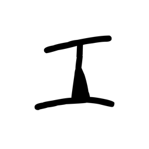
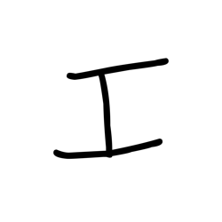
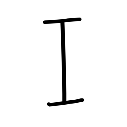
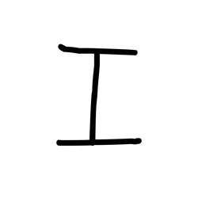
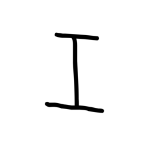
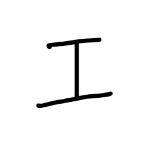
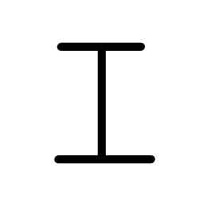
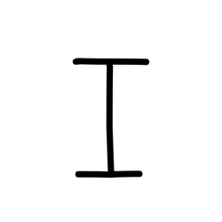
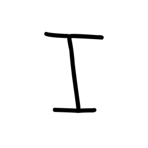

# Component Visual Gallery / 构件图像查看: obs-comp-cand-002483

English:
This page displays OBIMD subcharacter PNG assets extracted into this concrete corpus object directory for human review.

简体中文：
本页展示抽取到当前具体 corpus 对象目录内的 OBIMD subcharacter PNG 资料，供人工复核使用。

Boundary / 边界：dataset image candidate only; not a confirmed component form, component assignment, or decipherment claim.

## asset-020671

- source_zip_member: `Sub-character Images/oesivb520y/oesivb520y/654mztgsej.png`
- checksum_sha256: `46663d06a42c2b4bce48f3c5488ca1fd6f857464bab40658b586e07319ec92a5`
- review_status: `needs_human_visual_review`
- caution: OBIMD subcharacter image is a source-marked review asset only; it is not a confirmed component form, component assignment, or decipherment conclusion.

## asset-020672

- source_zip_member: `Sub-character Images/oesivb520y/oesivb520y/6q7cktkv0t.png`
- checksum_sha256: `9c8089b1cc62831cdc48fcc367bf0bb00f2155f6c5ec788c14e4bda18766eb8a`
- review_status: `needs_human_visual_review`
- caution: OBIMD subcharacter image is a source-marked review asset only; it is not a confirmed component form, component assignment, or decipherment conclusion.

## asset-020673

- source_zip_member: `Sub-character Images/oesivb520y/oesivb520y/d4so1isptr.png`
- checksum_sha256: `13b62e7b4c95d30ca086e4eb5b68956e93d20f87009b57e2c397d1e69f331cdd`
- review_status: `needs_human_visual_review`
- caution: OBIMD subcharacter image is a source-marked review asset only; it is not a confirmed component form, component assignment, or decipherment conclusion.

## asset-020674

- source_zip_member: `Sub-character Images/oesivb520y/oesivb520y/i52rsn8dek.png`
- checksum_sha256: `9e23e82a0b93ebc1c8b4d6ac2a06f772075f0b6dd201f87cc2313e02df891eaa`
- review_status: `needs_human_visual_review`
- caution: OBIMD subcharacter image is a source-marked review asset only; it is not a confirmed component form, component assignment, or decipherment conclusion.

## asset-020675

- source_zip_member: `Sub-character Images/oesivb520y/oesivb520y/j4tojn45pg.png`
- checksum_sha256: `6860a13a99973aaa7fe401e6087fe1f5c5e93028283061e6510d2b9cdd03dfe0`
- review_status: `needs_human_visual_review`
- caution: OBIMD subcharacter image is a source-marked review asset only; it is not a confirmed component form, component assignment, or decipherment conclusion.

## asset-020676

- source_zip_member: `Sub-character Images/oesivb520y/oesivb520y/juj5usgocn.png`
- checksum_sha256: `ca3cdd0193a4a348adf467b786923f2c22a08711c46535fded6ddeda6d5e1dcd`
- review_status: `needs_human_visual_review`
- caution: OBIMD subcharacter image is a source-marked review asset only; it is not a confirmed component form, component assignment, or decipherment conclusion.

## asset-020677

- source_zip_member: `Sub-character Images/oesivb520y/oesivb520y/lfqvvd3asf.png`
- checksum_sha256: `1131ef251772c46f5041e8a371149db2eb9f355fe268e54a9224e72d37676de3`
- review_status: `needs_human_visual_review`
- caution: OBIMD subcharacter image is a source-marked review asset only; it is not a confirmed component form, component assignment, or decipherment conclusion.

## asset-020678

- source_zip_member: `Sub-character Images/oesivb520y/oesivb520y/oesivb520y.png`
- checksum_sha256: `a930baa047b21123ac550fb1d4df503fa49e927ac1f946756d489394569f4059`
- review_status: `needs_human_visual_review`
- caution: OBIMD subcharacter image is a source-marked review asset only; it is not a confirmed component form, component assignment, or decipherment conclusion.

## asset-020679

- source_zip_member: `Sub-character Images/oesivb520y/oesivb520y/qjajz4octw.png`
- checksum_sha256: `7165a686e98581addbb3aa9a519d01be3308eaccbc15363e5a5cac62808a9c11`
- review_status: `needs_human_visual_review`
- caution: OBIMD subcharacter image is a source-marked review asset only; it is not a confirmed component form, component assignment, or decipherment conclusion.

## asset-020680

- source_zip_member: `Sub-character Images/oesivb520y/oesivb520y/u0abftq9pp.png`
- checksum_sha256: `8e36e6257a1120a81bce889dc1f8e06836c558c702840ca9ba62869a294f2f6b`
- review_status: `needs_human_visual_review`
- caution: OBIMD subcharacter image is a source-marked review asset only; it is not a confirmed component form, component assignment, or decipherment conclusion.

## asset-020681

- source_zip_member: `Sub-character Images/oesivb520y/oesivb520y/ycheee8twi.png`
- checksum_sha256: `98ececaf547d952ede7ecc2e887f9920002e43c93f04289a837602c92c1a8bf8`
- review_status: `needs_human_visual_review`
- caution: OBIMD subcharacter image is a source-marked review asset only; it is not a confirmed component form, component assignment, or decipherment conclusion.
