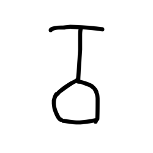
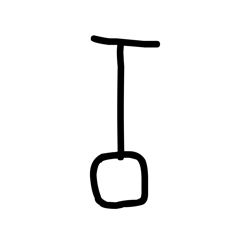
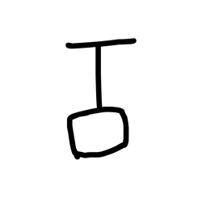
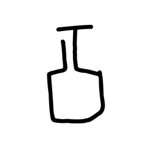
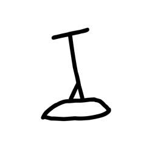
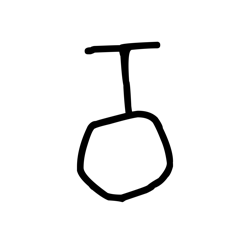
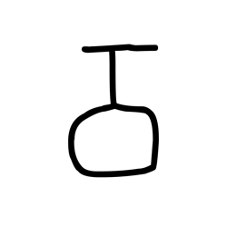
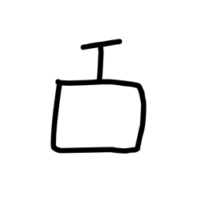
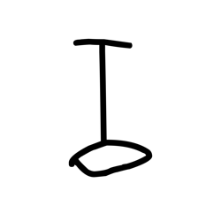

# Component Visual Gallery / 构件图像查看: obs-comp-cand-002484

English:
This page displays OBIMD subcharacter PNG assets extracted into this concrete
corpus object directory for human review.

简体中文：
本页展示抽取到当前具体 corpus 对象目录内的 OBIMD subcharacter PNG 资料，供人工复核使用。

Boundary / 边界：
dataset image candidate only; not a confirmed component form, not a component
assignment, and not a decipherment claim.
- not a confirmed component form
- not a component assignment
- not a decipherment claim

## Concrete Questions To Check / 具体待查问题

- Which local image should be opened first?
- 应先打开哪一张本地构件图像？
- Which source zip member anchors this image?
- 哪一个 source zip member 能定位这张图像？
- Which near-shape or variant comparison is still missing?
- 还缺哪些近形或异体比较？
- Which character or inscription context should be checked next?
- 下一步应核对哪些单字或卜辞上下文？
- What evidence is missing before a component assignment?
- 正式构件归属前还缺哪些证据？

## asset-020682

- source_zip_member: `Sub-character Images/em9wf77jqc/em9wf77jqc/5erlcizd8p.png`
- checksum_sha256: see `06_component-visual-index.csv`.
- review_status: `needs_human_visual_review`
- caution: source-marked review image only.

## asset-020683

- source_zip_member: `Sub-character Images/em9wf77jqc/em9wf77jqc/6id455kxe1.png`
- checksum_sha256: see `06_component-visual-index.csv`.
- review_status: `needs_human_visual_review`
- caution: source-marked review image only.

## asset-020684

- source_zip_member: `Sub-character Images/em9wf77jqc/em9wf77jqc/8vixotegub.png`
- checksum_sha256: see `06_component-visual-index.csv`.
- review_status: `needs_human_visual_review`
- caution: source-marked review image only.

## asset-020685

- source_zip_member: `Sub-character Images/em9wf77jqc/em9wf77jqc/b2qzd1ymy4.png`
- checksum_sha256: see `06_component-visual-index.csv`.
- review_status: `needs_human_visual_review`
- caution: source-marked review image only.

## asset-020686

- source_zip_member: `Sub-character Images/em9wf77jqc/em9wf77jqc/bwq5omfrim.png`
- checksum_sha256: see `06_component-visual-index.csv`.
- review_status: `needs_human_visual_review`
- caution: source-marked review image only.

## asset-020687

- source_zip_member: `Sub-character Images/em9wf77jqc/em9wf77jqc/c91pheatjn.png`
- checksum_sha256: see `06_component-visual-index.csv`.
- review_status: `needs_human_visual_review`
- caution: source-marked review image only.

## asset-020688

- source_zip_member: `Sub-character Images/em9wf77jqc/em9wf77jqc/dlhup3pm8g.png`
- checksum_sha256: see `06_component-visual-index.csv`.
- review_status: `needs_human_visual_review`
- caution: source-marked review image only.

## asset-020689

- source_zip_member: `Sub-character Images/em9wf77jqc/em9wf77jqc/em9wf77jqc.png`
- checksum_sha256: see `06_component-visual-index.csv`.
- review_status: `needs_human_visual_review`
- caution: source-marked review image only.

## asset-020690

- source_zip_member: `Sub-character Images/em9wf77jqc/em9wf77jqc/f5jzurduze.png`
- checksum_sha256: see `06_component-visual-index.csv`.
- review_status: `needs_human_visual_review`
- caution: source-marked review image only.

## asset-020691

- source_zip_member: `Sub-character Images/em9wf77jqc/em9wf77jqc/i72q6a534t.png`
- checksum_sha256: see `06_component-visual-index.csv`.
- review_status: `needs_human_visual_review`
- caution: source-marked review image only.

## asset-020692

- source_zip_member: `Sub-character Images/em9wf77jqc/em9wf77jqc/jeiedwlzau.png`
- checksum_sha256: see `06_component-visual-index.csv`.
- review_status: `needs_human_visual_review`
- caution: source-marked review image only.

## asset-020693

- source_zip_member: `Sub-character Images/em9wf77jqc/em9wf77jqc/ksin25jeay.png`
- checksum_sha256: see `06_component-visual-index.csv`.
- review_status: `needs_human_visual_review`
- caution: source-marked review image only.

## asset-020694

- source_zip_member: `Sub-character Images/em9wf77jqc/em9wf77jqc/qxayw2zr96.png`
- checksum_sha256: see `06_component-visual-index.csv`.
- review_status: `needs_human_visual_review`
- caution: source-marked review image only.

## asset-020695

- source_zip_member: `Sub-character Images/em9wf77jqc/em9wf77jqc/qxrdv1qtp5.png`
- checksum_sha256: see `06_component-visual-index.csv`.
- review_status: `needs_human_visual_review`
- caution: source-marked review image only.

## asset-020696

- source_zip_member: `Sub-character Images/em9wf77jqc/em9wf77jqc/r2zg2yogo0.png`
- checksum_sha256: see `06_component-visual-index.csv`.
- review_status: `needs_human_visual_review`
- caution: source-marked review image only.

## asset-020697

- source_zip_member: `Sub-character Images/em9wf77jqc/em9wf77jqc/rhs9aatz8e.png`
- checksum_sha256: see `06_component-visual-index.csv`.
- review_status: `needs_human_visual_review`
- caution: source-marked review image only.

## asset-020698

- source_zip_member: `Sub-character Images/em9wf77jqc/em9wf77jqc/rm8xixzj01.png`
- checksum_sha256: see `06_component-visual-index.csv`.
- review_status: `needs_human_visual_review`
- caution: source-marked review image only.

## asset-020699

- source_zip_member: `Sub-character Images/em9wf77jqc/em9wf77jqc/tg3vy9hgwd.png`
- checksum_sha256: see `06_component-visual-index.csv`.
- review_status: `needs_human_visual_review`
- caution: source-marked review image only.

## asset-020700

- source_zip_member: `Sub-character Images/em9wf77jqc/em9wf77jqc/ub1tb3gyl4.png`
- checksum_sha256: see `06_component-visual-index.csv`.
- review_status: `needs_human_visual_review`
- caution: source-marked review image only.

## asset-020701

- source_zip_member: `Sub-character Images/em9wf77jqc/em9wf77jqc/xbuhx96fdp.png`
- checksum_sha256: see `06_component-visual-index.csv`.
- review_status: `needs_human_visual_review`
- caution: source-marked review image only.

## asset-020702

- source_zip_member: `Sub-character Images/em9wf77jqc/em9wf77jqc/xpcmf7w5do.png`
- checksum_sha256: see `06_component-visual-index.csv`.
- review_status: `needs_human_visual_review`
- caution: source-marked review image only.

## asset-020703

- source_zip_member: `Sub-character Images/em9wf77jqc/em9wf77jqc/y55hl26jqt.png`
- checksum_sha256: see `06_component-visual-index.csv`.
- review_status: `needs_human_visual_review`
- caution: source-marked review image only.

## asset-020704

- source_zip_member: `Sub-character Images/em9wf77jqc/em9wf77jqc/ybha93hmeu.png`
- checksum_sha256: see `06_component-visual-index.csv`.
- review_status: `needs_human_visual_review`
- caution: source-marked review image only.
