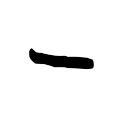
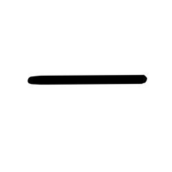

# Component Visual Gallery / 构件图像查看: obs-comp-cand-002490

English:
This page displays OBIMD subcharacter PNG assets extracted into this concrete corpus object directory for human review.

简体中文：
本页展示抽取到当前具体 corpus 对象目录内的 OBIMD subcharacter PNG 资料，供人工复核使用。

Boundary / 边界：dataset image candidate only; not a confirmed component form, component assignment, or decipherment claim.

## asset-020710

- source_zip_member: `Sub-character Images/jrzjjh3g1r/jrzjjh3g1r/04ty7mn57j.png`
- checksum_sha256: `0b02caeed6344f7a9ccf369a2249cb601ca717cf9c66a5eed5ed0d73d862c2a2`
- review_status: `needs_human_visual_review`
- caution: OBIMD subcharacter image is a source-marked review asset only; it is not a confirmed component form, component assignment, or decipherment conclusion.

## asset-020711

- source_zip_member: `Sub-character Images/jrzjjh3g1r/jrzjjh3g1r/jrzjjh3g1r.png`
- checksum_sha256: `480475c010739429f5c3129f18d6ea90cc30dfdbd12d104cac00acebe1c6f137`
- review_status: `needs_human_visual_review`
- caution: OBIMD subcharacter image is a source-marked review asset only; it is not a confirmed component form, component assignment, or decipherment conclusion.

## asset-020712

- source_zip_member: `Sub-character Images/jrzjjh3g1r/jrzjjh3g1r/ziets5h1ik.png`
- checksum_sha256: `71e670ca33ea758ac6321471bd1232f5a6f5fe81ff97acbc895e17bec24b2239`
- review_status: `needs_human_visual_review`
- caution: OBIMD subcharacter image is a source-marked review asset only; it is not a confirmed component form, component assignment, or decipherment conclusion.
