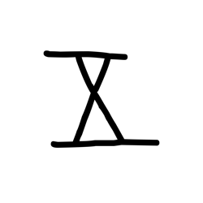
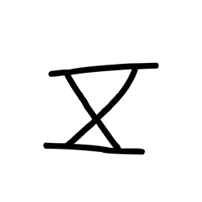
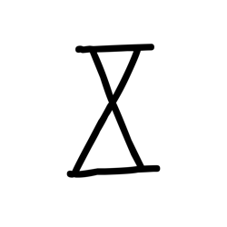
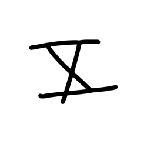
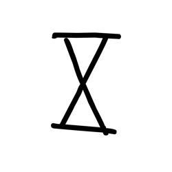
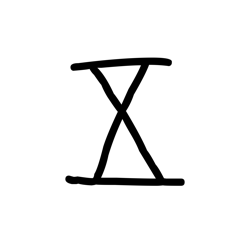
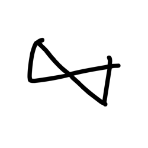
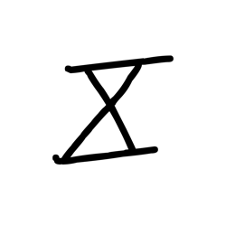

# Component Visual Gallery / 构件图像查看: obs-comp-cand-002496

English:
This page displays OBIMD subcharacter PNG assets extracted into this concrete
corpus object directory for human review.

简体中文：
本页展示抽取到当前具体 corpus 对象目录内的 OBIMD subcharacter PNG 资料，供人工复核使用。

Boundary / 边界：
dataset image candidate only; not a confirmed component form, not a component
assignment, and not a decipherment claim.
- not a confirmed component form
- not a component assignment
- not a decipherment claim

## Concrete Questions To Check / 具体待查问题

- Which local image should be opened first?
- 应先打开哪一张本地构件图像？
- Which source zip member anchors this image?
- 哪一个 source zip member 能定位这张图像？
- Which near-shape or variant comparison is still missing?
- 还缺哪些近形或异体比较？
- Which character or inscription context should be checked next?
- 下一步应核对哪些单字或卜辞上下文？
- What evidence is missing before a component assignment?
- 正式构件归属前还缺哪些证据？

## asset-020732

- source_zip_member: `Sub-character Images/s2e076ohb1/s2e076ohb1/1cx4z5quxf.png`
- checksum_sha256: see `06_component-visual-index.csv`.
- review_status: `needs_human_visual_review`
- caution: source-marked review image only.

## asset-020733

- source_zip_member: `Sub-character Images/s2e076ohb1/s2e076ohb1/1jo4ifyd0o.png`
- checksum_sha256: see `06_component-visual-index.csv`.
- review_status: `needs_human_visual_review`
- caution: source-marked review image only.

## asset-020734

- source_zip_member: `Sub-character Images/s2e076ohb1/s2e076ohb1/7ml55grgtf.png`
- checksum_sha256: see `06_component-visual-index.csv`.
- review_status: `needs_human_visual_review`
- caution: source-marked review image only.

## asset-020735

- source_zip_member: `Sub-character Images/s2e076ohb1/s2e076ohb1/8otjaoxu6f.png`
- checksum_sha256: see `06_component-visual-index.csv`.
- review_status: `needs_human_visual_review`
- caution: source-marked review image only.

## asset-020736

- source_zip_member: `Sub-character Images/s2e076ohb1/s2e076ohb1/9c89aag1qj.png`
- checksum_sha256: see `06_component-visual-index.csv`.
- review_status: `needs_human_visual_review`
- caution: source-marked review image only.

## asset-020737

- source_zip_member: `Sub-character Images/s2e076ohb1/s2e076ohb1/9cystewrqj.png`
- checksum_sha256: see `06_component-visual-index.csv`.
- review_status: `needs_human_visual_review`
- caution: source-marked review image only.

## asset-020738

- source_zip_member: `Sub-character Images/s2e076ohb1/s2e076ohb1/9ktcmar7wz.png`
- checksum_sha256: see `06_component-visual-index.csv`.
- review_status: `needs_human_visual_review`
- caution: source-marked review image only.

## asset-020739

- source_zip_member: `Sub-character Images/s2e076ohb1/s2e076ohb1/c6yneudpza.png`
- checksum_sha256: see `06_component-visual-index.csv`.
- review_status: `needs_human_visual_review`
- caution: source-marked review image only.

## asset-020740

- source_zip_member: `Sub-character Images/s2e076ohb1/s2e076ohb1/e3y0a0xrig.png`
- checksum_sha256: see `06_component-visual-index.csv`.
- review_status: `needs_human_visual_review`
- caution: source-marked review image only.

## asset-020741

- source_zip_member: `Sub-character Images/s2e076ohb1/s2e076ohb1/ehf74z0v2w.png`
- checksum_sha256: see `06_component-visual-index.csv`.
- review_status: `needs_human_visual_review`
- caution: source-marked review image only.

## asset-020742

- source_zip_member: `Sub-character Images/s2e076ohb1/s2e076ohb1/fkiyo9d7sb.png`
- checksum_sha256: see `06_component-visual-index.csv`.
- review_status: `needs_human_visual_review`
- caution: source-marked review image only.

## asset-020743

- source_zip_member: `Sub-character Images/s2e076ohb1/s2e076ohb1/h1wwd4f23e.png`
- checksum_sha256: see `06_component-visual-index.csv`.
- review_status: `needs_human_visual_review`
- caution: source-marked review image only.

## asset-020744

- source_zip_member: `Sub-character Images/s2e076ohb1/s2e076ohb1/kexqfa0q7n.png`
- checksum_sha256: see `06_component-visual-index.csv`.
- review_status: `needs_human_visual_review`
- caution: source-marked review image only.

## asset-020745

- source_zip_member: `Sub-character Images/s2e076ohb1/s2e076ohb1/kl8kcucqhg.png`
- checksum_sha256: see `06_component-visual-index.csv`.
- review_status: `needs_human_visual_review`
- caution: source-marked review image only.

## asset-020746

- source_zip_member: `Sub-character Images/s2e076ohb1/s2e076ohb1/pg57mup7sx.png`
- checksum_sha256: see `06_component-visual-index.csv`.
- review_status: `needs_human_visual_review`
- caution: source-marked review image only.

## asset-020747

- source_zip_member: `Sub-character Images/s2e076ohb1/s2e076ohb1/s2e076ohb1.png`
- checksum_sha256: see `06_component-visual-index.csv`.
- review_status: `needs_human_visual_review`
- caution: source-marked review image only.

## asset-020748

- source_zip_member: `Sub-character Images/s2e076ohb1/s2e076ohb1/snehohhpdh.png`
- checksum_sha256: see `06_component-visual-index.csv`.
- review_status: `needs_human_visual_review`
- caution: source-marked review image only.

## asset-020749

- source_zip_member: `Sub-character Images/s2e076ohb1/s2e076ohb1/u9qf2kwfti.png`
- checksum_sha256: see `06_component-visual-index.csv`.
- review_status: `needs_human_visual_review`
- caution: source-marked review image only.

## asset-020750

- source_zip_member: `Sub-character Images/s2e076ohb1/s2e076ohb1/zwovxtts8t.png`
- checksum_sha256: see `06_component-visual-index.csv`.
- review_status: `needs_human_visual_review`
- caution: source-marked review image only.
