# Component Visual Gallery / 构件图像查看: obs-comp-cand-002510

English:
This page displays OBIMD subcharacter PNG assets extracted into this concrete corpus object directory for human review.

简体中文：
本页展示抽取到当前具体 corpus 对象目录内的 OBIMD subcharacter PNG 资料，供人工复核使用。

Boundary / 边界：dataset image candidate only; not a confirmed component form, component assignment, or decipherment claim.

## asset-020785

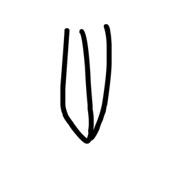

- source_zip_member: `Sub-character Images/jfc5ld8k0t/jfc5ld8k0t/0b4tcsvjzp.png`
- checksum_sha256: `5cc2eaa4c0c86062ffb741d5803e0d8321eb77891bf6e4d08ac715a2ba1a5f58`
- review_status: `needs_human_visual_review`
- caution: OBIMD subcharacter image is a source-marked review asset only; it is not a confirmed component form, component assignment, or decipherment conclusion.

## asset-020786

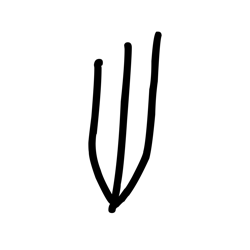

- source_zip_member: `Sub-character Images/jfc5ld8k0t/jfc5ld8k0t/0l8e9y2ddl.png`
- checksum_sha256: `bb7d9291b93abda11c75b9c0610f73cbc9f39bf51709e5bca1f482c87607662e`
- review_status: `needs_human_visual_review`
- caution: OBIMD subcharacter image is a source-marked review asset only; it is not a confirmed component form, component assignment, or decipherment conclusion.

## asset-020787

- source_zip_member: `Sub-character Images/jfc5ld8k0t/jfc5ld8k0t/4dz0ztmzug.png`
- checksum_sha256: `d734fdad3b6f07cad2d1668f32207dcde99a7b646d1b90c6e2c21b1faac23a2b`
- review_status: `needs_human_visual_review`
- caution: OBIMD subcharacter image is a source-marked review asset only; it is not a confirmed component form, component assignment, or decipherment conclusion.

## asset-020788

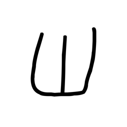

- source_zip_member: `Sub-character Images/jfc5ld8k0t/jfc5ld8k0t/4iuzr3q265.png`
- checksum_sha256: `ec07e06d31b88c2daf15d2b101ada0389b3cee79e9ced459b6f138ac6a535dc6`
- review_status: `needs_human_visual_review`
- caution: OBIMD subcharacter image is a source-marked review asset only; it is not a confirmed component form, component assignment, or decipherment conclusion.

## asset-020789

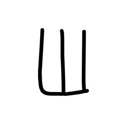

- source_zip_member: `Sub-character Images/jfc5ld8k0t/jfc5ld8k0t/5grmwlwb6b.png`
- checksum_sha256: `8641b4bf1b3fb6c59ca4f022f83ad885e13c6f3e9c442c2324585f7f361de765`
- review_status: `needs_human_visual_review`
- caution: OBIMD subcharacter image is a source-marked review asset only; it is not a confirmed component form, component assignment, or decipherment conclusion.

## asset-020790

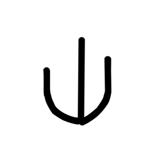

- source_zip_member: `Sub-character Images/jfc5ld8k0t/jfc5ld8k0t/8bx7bq4wzb.png`
- checksum_sha256: `dd8dd7f96307cf520b17e04abde8a965fe57d596486a304a698a692c8b0ca3aa`
- review_status: `needs_human_visual_review`
- caution: OBIMD subcharacter image is a source-marked review asset only; it is not a confirmed component form, component assignment, or decipherment conclusion.

## asset-020791

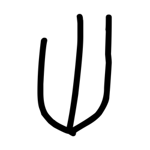

- source_zip_member: `Sub-character Images/jfc5ld8k0t/jfc5ld8k0t/8jukpr0bk6.png`
- checksum_sha256: `f92ed22608496b338cf36d151c94c7f820fee177831bda46209a22a2beb1c14a`
- review_status: `needs_human_visual_review`
- caution: OBIMD subcharacter image is a source-marked review asset only; it is not a confirmed component form, component assignment, or decipherment conclusion.

## asset-020792

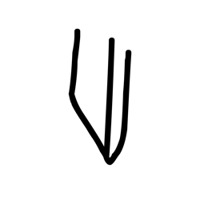

- source_zip_member: `Sub-character Images/jfc5ld8k0t/jfc5ld8k0t/9vcs6npnfv.png`
- checksum_sha256: `368c99b4194d551bd92c634548b18162ba2a464188a0c46ac9c445e1f9df720a`
- review_status: `needs_human_visual_review`
- caution: OBIMD subcharacter image is a source-marked review asset only; it is not a confirmed component form, component assignment, or decipherment conclusion.

## asset-020793

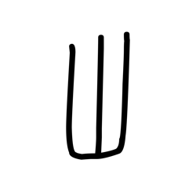

- source_zip_member: `Sub-character Images/jfc5ld8k0t/jfc5ld8k0t/cbszaf5fmb.png`
- checksum_sha256: `da10715e47c0f17c6eea7592dfcab35a871113037e3d29387993e28b35baa131`
- review_status: `needs_human_visual_review`
- caution: OBIMD subcharacter image is a source-marked review asset only; it is not a confirmed component form, component assignment, or decipherment conclusion.

## asset-020794

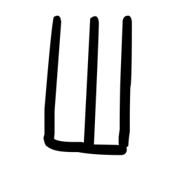

- source_zip_member: `Sub-character Images/jfc5ld8k0t/jfc5ld8k0t/dsh0xqny91.png`
- checksum_sha256: `594230f93664df9f1bdd5f49be3b73bac2920cf01144e521031a194e73aa607c`
- review_status: `needs_human_visual_review`
- caution: OBIMD subcharacter image is a source-marked review asset only; it is not a confirmed component form, component assignment, or decipherment conclusion.

## asset-020795

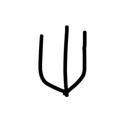

- source_zip_member: `Sub-character Images/jfc5ld8k0t/jfc5ld8k0t/expfr5q9s2.png`
- checksum_sha256: `0a0d596767ce6f36a24372fe4968d4b942eaaad1e83351b39c67a33eb7c8cedc`
- review_status: `needs_human_visual_review`
- caution: OBIMD subcharacter image is a source-marked review asset only; it is not a confirmed component form, component assignment, or decipherment conclusion.

## asset-020796

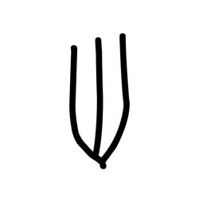

- source_zip_member: `Sub-character Images/jfc5ld8k0t/jfc5ld8k0t/h4p4hrr1yx.png`
- checksum_sha256: `a83449bd4dc80ad1218ec97811451cacafba957374e820af816fe4a07a589007`
- review_status: `needs_human_visual_review`
- caution: OBIMD subcharacter image is a source-marked review asset only; it is not a confirmed component form, component assignment, or decipherment conclusion.

## asset-020797

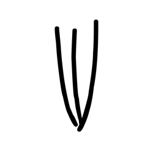

- source_zip_member: `Sub-character Images/jfc5ld8k0t/jfc5ld8k0t/heuzu92yvm.png`
- checksum_sha256: `b21549a20d84e24879c82c72db7d9d1446ec4cba637d7216d4264fd2f2e27882`
- review_status: `needs_human_visual_review`
- caution: OBIMD subcharacter image is a source-marked review asset only; it is not a confirmed component form, component assignment, or decipherment conclusion.

## asset-020798

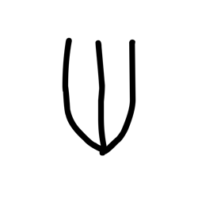

- source_zip_member: `Sub-character Images/jfc5ld8k0t/jfc5ld8k0t/hgrqgqdkmy.png`
- checksum_sha256: `5068a38b2bc5bd191ecefc82a081484b54682da40fec8489e34c461a8dbc1331`
- review_status: `needs_human_visual_review`
- caution: OBIMD subcharacter image is a source-marked review asset only; it is not a confirmed component form, component assignment, or decipherment conclusion.

## asset-020799

- source_zip_member: `Sub-character Images/jfc5ld8k0t/jfc5ld8k0t/hibbijfcbw.png`
- checksum_sha256: `aa1a561ff4919ff238452cefd4e0fb46425b00e759087a55d3c179508def6b61`
- review_status: `needs_human_visual_review`
- caution: OBIMD subcharacter image is a source-marked review asset only; it is not a confirmed component form, component assignment, or decipherment conclusion.

## asset-020800

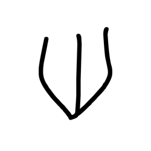

- source_zip_member: `Sub-character Images/jfc5ld8k0t/jfc5ld8k0t/hs4mqhij4m.png`
- checksum_sha256: `9c7be277991c46821faa27e5a52ea5942da1fb57b394c985dae9e67fbe10ec3a`
- review_status: `needs_human_visual_review`
- caution: OBIMD subcharacter image is a source-marked review asset only; it is not a confirmed component form, component assignment, or decipherment conclusion.

## asset-020801

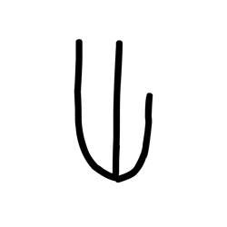

- source_zip_member: `Sub-character Images/jfc5ld8k0t/jfc5ld8k0t/idup5ba3ti.png`
- checksum_sha256: `da642c0a22195797919a70111aa5e0fae44fd59614bdfdbde5abb9b6314524c1`
- review_status: `needs_human_visual_review`
- caution: OBIMD subcharacter image is a source-marked review asset only; it is not a confirmed component form, component assignment, or decipherment conclusion.

## asset-020802

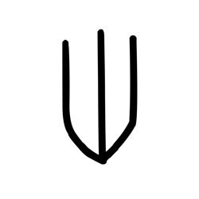

- source_zip_member: `Sub-character Images/jfc5ld8k0t/jfc5ld8k0t/jfc5ld8k0t.png`
- checksum_sha256: `53b2a7beecbd7774e19788323a8a1599461d2776de695028a9b9b2af3c1f1ab1`
- review_status: `needs_human_visual_review`
- caution: OBIMD subcharacter image is a source-marked review asset only; it is not a confirmed component form, component assignment, or decipherment conclusion.

## asset-020803

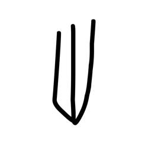

- source_zip_member: `Sub-character Images/jfc5ld8k0t/jfc5ld8k0t/jpfdd7s2bg.png`
- checksum_sha256: `80428b2935aff765db8ce2743ba25c28b565248fa6f38dc2505978db551980b2`
- review_status: `needs_human_visual_review`
- caution: OBIMD subcharacter image is a source-marked review asset only; it is not a confirmed component form, component assignment, or decipherment conclusion.

## asset-020804

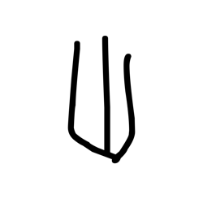

- source_zip_member: `Sub-character Images/jfc5ld8k0t/jfc5ld8k0t/klnwvf4vsp.png`
- checksum_sha256: `8a677e80351bb7c3a9f55f0083258ef6f0d9e933a6b1ea5050a5a95732605bca`
- review_status: `needs_human_visual_review`
- caution: OBIMD subcharacter image is a source-marked review asset only; it is not a confirmed component form, component assignment, or decipherment conclusion.

## asset-020805

- source_zip_member: `Sub-character Images/jfc5ld8k0t/jfc5ld8k0t/nh23qv82i3.png`
- checksum_sha256: `c5f1bb5029852f552eac1668c7ea303727c2c41bc02833b04380536a2ee1db03`
- review_status: `needs_human_visual_review`
- caution: OBIMD subcharacter image is a source-marked review asset only; it is not a confirmed component form, component assignment, or decipherment conclusion.

## asset-020806

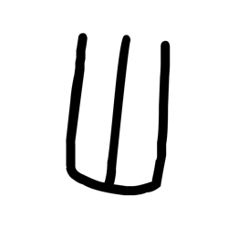

- source_zip_member: `Sub-character Images/jfc5ld8k0t/jfc5ld8k0t/o76nlsc5lr.png`
- checksum_sha256: `0f5caddd96bef2bc6f946a76fc9c359ffcb790d069a66136ace05be014ae150f`
- review_status: `needs_human_visual_review`
- caution: OBIMD subcharacter image is a source-marked review asset only; it is not a confirmed component form, component assignment, or decipherment conclusion.

## asset-020807

- source_zip_member: `Sub-character Images/jfc5ld8k0t/jfc5ld8k0t/oyk8sydk7o.png`
- checksum_sha256: `a7b33a11e4f193aed758b7a91451294ee5f3c429b8a9324c7fd40754b08e2e6d`
- review_status: `needs_human_visual_review`
- caution: OBIMD subcharacter image is a source-marked review asset only; it is not a confirmed component form, component assignment, or decipherment conclusion.

## asset-020808

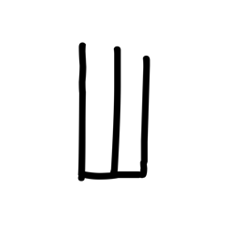

- source_zip_member: `Sub-character Images/jfc5ld8k0t/jfc5ld8k0t/p7u75tcmyi.png`
- checksum_sha256: `a9c3b1debc08e1dd76045bb01bb56cfdd67fc415549af0768e921215e304477b`
- review_status: `needs_human_visual_review`
- caution: OBIMD subcharacter image is a source-marked review asset only; it is not a confirmed component form, component assignment, or decipherment conclusion.

## asset-020809

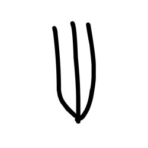

- source_zip_member: `Sub-character Images/jfc5ld8k0t/jfc5ld8k0t/pea09701t4.png`
- checksum_sha256: `bd9209c8e20a2951e7c8772f8c5f17a208e528c7276003b858cefa04cb6747e4`
- review_status: `needs_human_visual_review`
- caution: OBIMD subcharacter image is a source-marked review asset only; it is not a confirmed component form, component assignment, or decipherment conclusion.

## asset-020810

- source_zip_member: `Sub-character Images/jfc5ld8k0t/jfc5ld8k0t/qvqqjw0yjr.png`
- checksum_sha256: `5bbbdf66d0fe05156afb3d314e3adc7ba63ecc488abb7cd3fe4c6cbecf4ecb8c`
- review_status: `needs_human_visual_review`
- caution: OBIMD subcharacter image is a source-marked review asset only; it is not a confirmed component form, component assignment, or decipherment conclusion.

## asset-020811

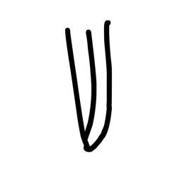

- source_zip_member: `Sub-character Images/jfc5ld8k0t/jfc5ld8k0t/rf7cemu3gr.png`
- checksum_sha256: `d30b0d513ab7f87eed135907efdf067ce7c3ed67e9d09a93de0356d9be952bd9`
- review_status: `needs_human_visual_review`
- caution: OBIMD subcharacter image is a source-marked review asset only; it is not a confirmed component form, component assignment, or decipherment conclusion.

## asset-020812

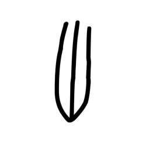

- source_zip_member: `Sub-character Images/jfc5ld8k0t/jfc5ld8k0t/tqpaem6eag.png`
- checksum_sha256: `451f1ab0893cc6d3f9269aa1ce2a662398eb74e085f8400f944505ffef1e9d38`
- review_status: `needs_human_visual_review`
- caution: OBIMD subcharacter image is a source-marked review asset only; it is not a confirmed component form, component assignment, or decipherment conclusion.

## asset-020813

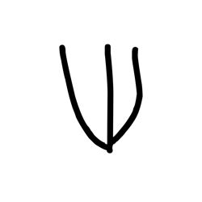

- source_zip_member: `Sub-character Images/jfc5ld8k0t/jfc5ld8k0t/tva5eaw8gs.png`
- checksum_sha256: `9c54f4d52eac6f8620192d971d41e1ab58d8f775f795c3d9a616c0d16000cac4`
- review_status: `needs_human_visual_review`
- caution: OBIMD subcharacter image is a source-marked review asset only; it is not a confirmed component form, component assignment, or decipherment conclusion.

## asset-020814

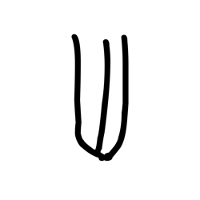

- source_zip_member: `Sub-character Images/jfc5ld8k0t/jfc5ld8k0t/uachof1agl.png`
- checksum_sha256: `e813f03c7103b5af9f319712060818b2c944611222011d9e79bd5d0dd9327252`
- review_status: `needs_human_visual_review`
- caution: OBIMD subcharacter image is a source-marked review asset only; it is not a confirmed component form, component assignment, or decipherment conclusion.

## asset-020815

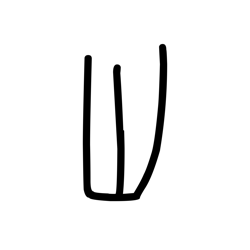

- source_zip_member: `Sub-character Images/jfc5ld8k0t/jfc5ld8k0t/w8r6n34yv1.png`
- checksum_sha256: `7a05baa1cf071326b182fa196627d3707c746c64288aad22f8d606bb02776fd3`
- review_status: `needs_human_visual_review`
- caution: OBIMD subcharacter image is a source-marked review asset only; it is not a confirmed component form, component assignment, or decipherment conclusion.

## asset-020816

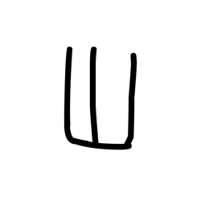

- source_zip_member: `Sub-character Images/jfc5ld8k0t/jfc5ld8k0t/xljs91n3lu.png`
- checksum_sha256: `86de2adb5d30bee7df360d57f3fa2bb307da6f7d985830bb7c4503fc333cbd51`
- review_status: `needs_human_visual_review`
- caution: OBIMD subcharacter image is a source-marked review asset only; it is not a confirmed component form, component assignment, or decipherment conclusion.
