# Component Visual Gallery / 构件图像查看: obs-comp-cand-002516

English:
This page displays OBIMD subcharacter PNG assets extracted into this concrete
corpus object directory for human review.

简体中文：
本页展示抽取到当前具体 corpus 对象目录内的 OBIMD subcharacter PNG 资料，供人工复核使用。

Boundary / 边界：
dataset image candidate only; not a confirmed component form, not a component
assignment, and not a decipherment claim.
- not a confirmed component form
- not a component assignment
- not a decipherment claim

## Concrete Questions To Check / 具体待查问题

- Open 06_component-visual-index.csv and name the local image row.
- 打开 06_component-visual-index.csv，写明本地图像行。
- Open 09_component-visual-route-index.csv and name the source route row.
- 打开 09_component-visual-route-index.csv，写明来源路线行。
- Open 13_component-context-evidence-dossier.md for character context.
- 打开 13_component-context-evidence-dossier.md，核对单字与卜辞上下文。
- Record the missing image, near-shape, source, or context route.
- 记录缺失的图像、近形、来源或上下文路线。

## asset-020840

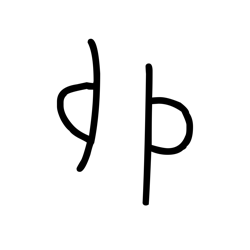

- source_zip_member: `Sub-character Images/ay8mkydpb2/ay8mkydpb2/0pm60llqp0.png`
- checksum_sha256: see `06_component-visual-index.csv`.
- review_status: `needs_human_visual_review`
- caution: source-marked review image only.

## asset-020841

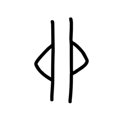

- source_zip_member: `Sub-character Images/ay8mkydpb2/ay8mkydpb2/0tpeootu6x.png`
- checksum_sha256: see `06_component-visual-index.csv`.
- review_status: `needs_human_visual_review`
- caution: source-marked review image only.

## asset-020842

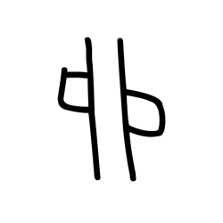

- source_zip_member: `Sub-character Images/ay8mkydpb2/ay8mkydpb2/2j48hnorwo.png`
- checksum_sha256: see `06_component-visual-index.csv`.
- review_status: `needs_human_visual_review`
- caution: source-marked review image only.

## asset-020843

- source_zip_member: `Sub-character Images/ay8mkydpb2/ay8mkydpb2/2n4clgktjw.png`
- checksum_sha256: see `06_component-visual-index.csv`.
- review_status: `needs_human_visual_review`
- caution: source-marked review image only.

## asset-020844

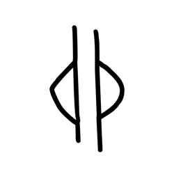

- source_zip_member: `Sub-character Images/ay8mkydpb2/ay8mkydpb2/404caddl00.png`
- checksum_sha256: see `06_component-visual-index.csv`.
- review_status: `needs_human_visual_review`
- caution: source-marked review image only.

## asset-020845

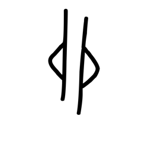

- source_zip_member: `Sub-character Images/ay8mkydpb2/ay8mkydpb2/40ynx0j9jc.png`
- checksum_sha256: see `06_component-visual-index.csv`.
- review_status: `needs_human_visual_review`
- caution: source-marked review image only.

## asset-020846

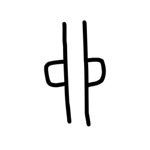

- source_zip_member: `Sub-character Images/ay8mkydpb2/ay8mkydpb2/4nf9kymbi7.png`
- checksum_sha256: see `06_component-visual-index.csv`.
- review_status: `needs_human_visual_review`
- caution: source-marked review image only.

## asset-020847

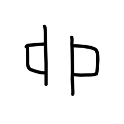

- source_zip_member: `Sub-character Images/ay8mkydpb2/ay8mkydpb2/4vr6yi8ogk.png`
- checksum_sha256: see `06_component-visual-index.csv`.
- review_status: `needs_human_visual_review`
- caution: source-marked review image only.

## asset-020848

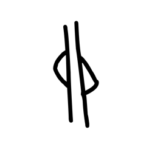

- source_zip_member: `Sub-character Images/ay8mkydpb2/ay8mkydpb2/5m7vai2h9x.png`
- checksum_sha256: see `06_component-visual-index.csv`.
- review_status: `needs_human_visual_review`
- caution: source-marked review image only.

## asset-020849

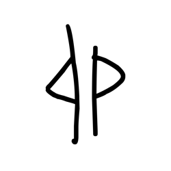

- source_zip_member: `Sub-character Images/ay8mkydpb2/ay8mkydpb2/708pt1mvip.png`
- checksum_sha256: see `06_component-visual-index.csv`.
- review_status: `needs_human_visual_review`
- caution: source-marked review image only.

## asset-020850

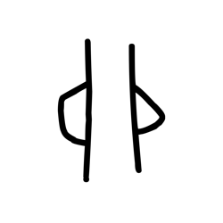

- source_zip_member: `Sub-character Images/ay8mkydpb2/ay8mkydpb2/7qlvx7zkd2.png`
- checksum_sha256: see `06_component-visual-index.csv`.
- review_status: `needs_human_visual_review`
- caution: source-marked review image only.

## asset-020851

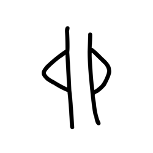

- source_zip_member: `Sub-character Images/ay8mkydpb2/ay8mkydpb2/842wfzkua7.png`
- checksum_sha256: see `06_component-visual-index.csv`.
- review_status: `needs_human_visual_review`
- caution: source-marked review image only.

## asset-020852

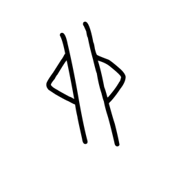

- source_zip_member: `Sub-character Images/ay8mkydpb2/ay8mkydpb2/8enplknjjt.png`
- checksum_sha256: see `06_component-visual-index.csv`.
- review_status: `needs_human_visual_review`
- caution: source-marked review image only.

## asset-020853

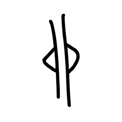

- source_zip_member: `Sub-character Images/ay8mkydpb2/ay8mkydpb2/8rmkfzm6mc.png`
- checksum_sha256: see `06_component-visual-index.csv`.
- review_status: `needs_human_visual_review`
- caution: source-marked review image only.

## asset-020854

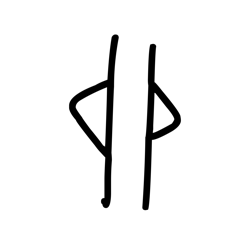

- source_zip_member: `Sub-character Images/ay8mkydpb2/ay8mkydpb2/a6mnlhss6u.png`
- checksum_sha256: see `06_component-visual-index.csv`.
- review_status: `needs_human_visual_review`
- caution: source-marked review image only.

## asset-020855

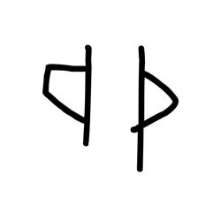

- source_zip_member: `Sub-character Images/ay8mkydpb2/ay8mkydpb2/apgr9dmt4j.png`
- checksum_sha256: see `06_component-visual-index.csv`.
- review_status: `needs_human_visual_review`
- caution: source-marked review image only.

## asset-020856

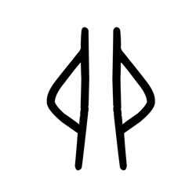

- source_zip_member: `Sub-character Images/ay8mkydpb2/ay8mkydpb2/ay8mkydpb2.png`
- checksum_sha256: see `06_component-visual-index.csv`.
- review_status: `needs_human_visual_review`
- caution: source-marked review image only.

## asset-020857

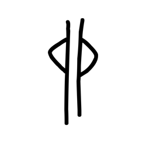

- source_zip_member: `Sub-character Images/ay8mkydpb2/ay8mkydpb2/cvwqz07fo0.png`
- checksum_sha256: see `06_component-visual-index.csv`.
- review_status: `needs_human_visual_review`
- caution: source-marked review image only.

## asset-020858

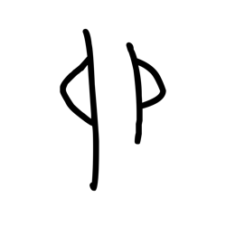

- source_zip_member: `Sub-character Images/ay8mkydpb2/ay8mkydpb2/eccphw5qbf.png`
- checksum_sha256: see `06_component-visual-index.csv`.
- review_status: `needs_human_visual_review`
- caution: source-marked review image only.

## asset-020859

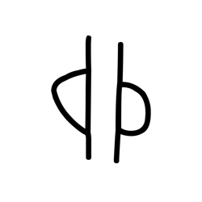

- source_zip_member: `Sub-character Images/ay8mkydpb2/ay8mkydpb2/ffz7gyi1na.png`
- checksum_sha256: see `06_component-visual-index.csv`.
- review_status: `needs_human_visual_review`
- caution: source-marked review image only.

## asset-020860

- source_zip_member: `Sub-character Images/ay8mkydpb2/ay8mkydpb2/h1pz4cbhy0.png`
- checksum_sha256: see `06_component-visual-index.csv`.
- review_status: `needs_human_visual_review`
- caution: source-marked review image only.

## asset-020861

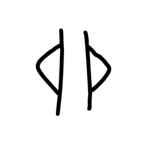

- source_zip_member: `Sub-character Images/ay8mkydpb2/ay8mkydpb2/hr591mdz5d.png`
- checksum_sha256: see `06_component-visual-index.csv`.
- review_status: `needs_human_visual_review`
- caution: source-marked review image only.

## asset-020862

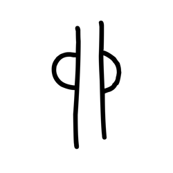

- source_zip_member: `Sub-character Images/ay8mkydpb2/ay8mkydpb2/im3qzl5c7w.png`
- checksum_sha256: see `06_component-visual-index.csv`.
- review_status: `needs_human_visual_review`
- caution: source-marked review image only.

## asset-020863

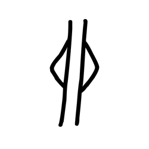

- source_zip_member: `Sub-character Images/ay8mkydpb2/ay8mkydpb2/je5fdgrv5v.png`
- checksum_sha256: see `06_component-visual-index.csv`.
- review_status: `needs_human_visual_review`
- caution: source-marked review image only.

## asset-020864

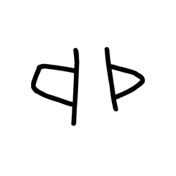

- source_zip_member: `Sub-character Images/ay8mkydpb2/ay8mkydpb2/nwte3mgwnl.png`
- checksum_sha256: see `06_component-visual-index.csv`.
- review_status: `needs_human_visual_review`
- caution: source-marked review image only.

## asset-020865

- source_zip_member: `Sub-character Images/ay8mkydpb2/ay8mkydpb2/nx9zndjgid.png`
- checksum_sha256: see `06_component-visual-index.csv`.
- review_status: `needs_human_visual_review`
- caution: source-marked review image only.

## asset-020866

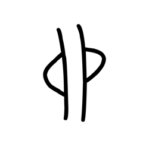

- source_zip_member: `Sub-character Images/ay8mkydpb2/ay8mkydpb2/p7u3psy26a.png`
- checksum_sha256: see `06_component-visual-index.csv`.
- review_status: `needs_human_visual_review`
- caution: source-marked review image only.

## asset-020867

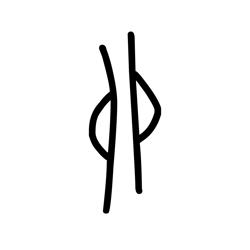

- source_zip_member: `Sub-character Images/ay8mkydpb2/ay8mkydpb2/q3qvd578iy.png`
- checksum_sha256: see `06_component-visual-index.csv`.
- review_status: `needs_human_visual_review`
- caution: source-marked review image only.

## asset-020868

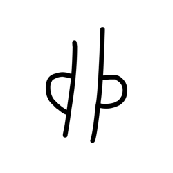

- source_zip_member: `Sub-character Images/ay8mkydpb2/ay8mkydpb2/rvzdre7m3h.png`
- checksum_sha256: see `06_component-visual-index.csv`.
- review_status: `needs_human_visual_review`
- caution: source-marked review image only.

## asset-020869

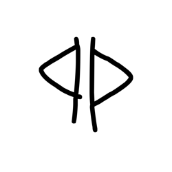

- source_zip_member: `Sub-character Images/ay8mkydpb2/ay8mkydpb2/skv7q86pch.png`
- checksum_sha256: see `06_component-visual-index.csv`.
- review_status: `needs_human_visual_review`
- caution: source-marked review image only.

## asset-020870

- source_zip_member: `Sub-character Images/ay8mkydpb2/ay8mkydpb2/ub5s3367f6.png`
- checksum_sha256: see `06_component-visual-index.csv`.
- review_status: `needs_human_visual_review`
- caution: source-marked review image only.

## asset-020871

- source_zip_member: `Sub-character Images/ay8mkydpb2/ay8mkydpb2/zbq0y9jcry.png`
- checksum_sha256: see `06_component-visual-index.csv`.
- review_status: `needs_human_visual_review`
- caution: source-marked review image only.
