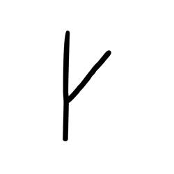
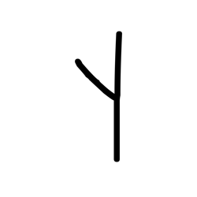
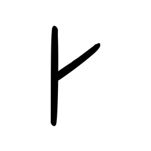
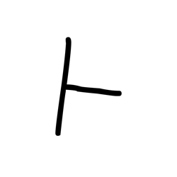
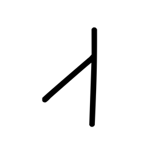

# Component Visual Gallery / 构件图像查看: obs-comp-cand-002517

English:
This page displays OBIMD subcharacter PNG assets extracted into this concrete corpus object directory for human review.

简体中文：
本页展示抽取到当前具体 corpus 对象目录内的 OBIMD subcharacter PNG 资料，供人工复核使用。

Boundary / 边界：dataset image candidate only; not a confirmed component form, component assignment, or decipherment claim.

## asset-020872

- source_zip_member: `Sub-character Images/h0gzv3styy/h0gzv3styy/67kmgrspzq.png`
- checksum_sha256: `77dbf1e0c4b51a66f4c0bbe9b86323d4ca9fc900b1512f28393ca0eb33537bc0`
- review_status: `needs_human_visual_review`
- caution: OBIMD subcharacter image is a source-marked review asset only; it is not a confirmed component form, component assignment, or decipherment conclusion.

## asset-020873

- source_zip_member: `Sub-character Images/h0gzv3styy/h0gzv3styy/9yu52qacar.png`
- checksum_sha256: `facfa83324fb88cca12b7676709e49f6a332f86ab63a59159a8f9ceb3064773b`
- review_status: `needs_human_visual_review`
- caution: OBIMD subcharacter image is a source-marked review asset only; it is not a confirmed component form, component assignment, or decipherment conclusion.

## asset-020874

- source_zip_member: `Sub-character Images/h0gzv3styy/h0gzv3styy/h0gzv3styy.png`
- checksum_sha256: `ac80361e6496b27065e9330ba54a7379603a7fd8e03d6ee1dfa0d5c3a87578b8`
- review_status: `needs_human_visual_review`
- caution: OBIMD subcharacter image is a source-marked review asset only; it is not a confirmed component form, component assignment, or decipherment conclusion.

## asset-020875

- source_zip_member: `Sub-character Images/h0gzv3styy/h0gzv3styy/z9qa8r133n.png`
- checksum_sha256: `a14ecffa3eaf1f999bc071239c0556af2e9cee7e55e50e17ffab3625c1651d9c`
- review_status: `needs_human_visual_review`
- caution: OBIMD subcharacter image is a source-marked review asset only; it is not a confirmed component form, component assignment, or decipherment conclusion.

## asset-020876

- source_zip_member: `Sub-character Images/h0gzv3styy/h0gzv3styy/zi6b8abdjm.png`
- checksum_sha256: `5fa52dd79f45518ac1cc91ff64aef19b169991bd9fa8632924e52a7f856b15c1`
- review_status: `needs_human_visual_review`
- caution: OBIMD subcharacter image is a source-marked review asset only; it is not a confirmed component form, component assignment, or decipherment conclusion.
