# Component Visual Gallery / 构件图像查看: obs-comp-cand-002518

English:
This page displays OBIMD subcharacter PNG assets extracted into this concrete
corpus object directory for human review.

简体中文：
本页展示抽取到当前具体 corpus 对象目录内的 OBIMD subcharacter PNG 资料，供人工复核使用。

Boundary / 边界：
dataset image candidate only; not a confirmed component form, not a component
assignment, and not a decipherment claim.
- not a confirmed component form
- not a component assignment
- not a decipherment claim

## Concrete Questions To Check / 具体待查问题

- Which local image should be opened first?
- 应先打开哪一张本地构件图像？
- Which source zip member anchors this image?
- 哪一个 source zip member 能定位这张图像？
- Which near-shape or variant comparison is still missing?
- 还缺哪些近形或异体比较？
- Which character or inscription context should be checked next?
- 下一步应核对哪些单字或卜辞上下文？
- What evidence is missing before a component assignment?
- 正式构件归属前还缺哪些证据？

## asset-020877

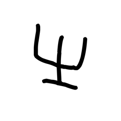

- source_zip_member: `Sub-character Images/0uhj5zj3ce/0uhj5zj3ce/0cmbg4udd6.png`
- checksum_sha256: see `06_component-visual-index.csv`.
- review_status: `needs_human_visual_review`
- caution: source-marked review image only.

## asset-020878

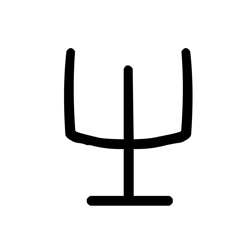

- source_zip_member: `Sub-character Images/0uhj5zj3ce/0uhj5zj3ce/0uhj5zj3ce.png`
- checksum_sha256: see `06_component-visual-index.csv`.
- review_status: `needs_human_visual_review`
- caution: source-marked review image only.

## asset-020879

- source_zip_member: `Sub-character Images/0uhj5zj3ce/0uhj5zj3ce/1jfw98sb0l.png`
- checksum_sha256: see `06_component-visual-index.csv`.
- review_status: `needs_human_visual_review`
- caution: source-marked review image only.

## asset-020880

- source_zip_member: `Sub-character Images/0uhj5zj3ce/0uhj5zj3ce/26ssttdpwe.png`
- checksum_sha256: see `06_component-visual-index.csv`.
- review_status: `needs_human_visual_review`
- caution: source-marked review image only.

## asset-020881

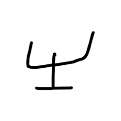

- source_zip_member: `Sub-character Images/0uhj5zj3ce/0uhj5zj3ce/4ec5decvry.png`
- checksum_sha256: see `06_component-visual-index.csv`.
- review_status: `needs_human_visual_review`
- caution: source-marked review image only.

## asset-020882

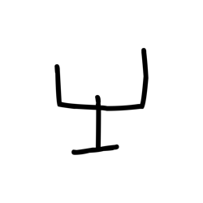

- source_zip_member: `Sub-character Images/0uhj5zj3ce/0uhj5zj3ce/4fehe8qge6.png`
- checksum_sha256: see `06_component-visual-index.csv`.
- review_status: `needs_human_visual_review`
- caution: source-marked review image only.

## asset-020883

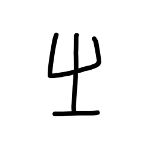

- source_zip_member: `Sub-character Images/0uhj5zj3ce/0uhj5zj3ce/50te4q9fyp.png`
- checksum_sha256: see `06_component-visual-index.csv`.
- review_status: `needs_human_visual_review`
- caution: source-marked review image only.

## asset-020884

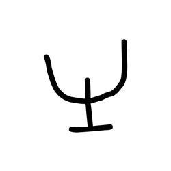

- source_zip_member: `Sub-character Images/0uhj5zj3ce/0uhj5zj3ce/6gri3sekyr.png`
- checksum_sha256: see `06_component-visual-index.csv`.
- review_status: `needs_human_visual_review`
- caution: source-marked review image only.

## asset-020885

- source_zip_member: `Sub-character Images/0uhj5zj3ce/0uhj5zj3ce/7gjj0e65up.png`
- checksum_sha256: see `06_component-visual-index.csv`.
- review_status: `needs_human_visual_review`
- caution: source-marked review image only.

## asset-020886

- source_zip_member: `Sub-character Images/0uhj5zj3ce/0uhj5zj3ce/7odggz7v8r.png`
- checksum_sha256: see `06_component-visual-index.csv`.
- review_status: `needs_human_visual_review`
- caution: source-marked review image only.

## asset-020887

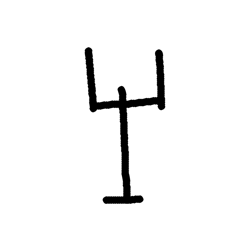

- source_zip_member: `Sub-character Images/0uhj5zj3ce/0uhj5zj3ce/8wrlmld2gs.png`
- checksum_sha256: see `06_component-visual-index.csv`.
- review_status: `needs_human_visual_review`
- caution: source-marked review image only.

## asset-020888

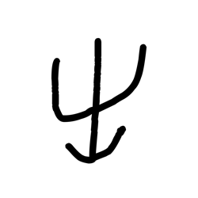

- source_zip_member: `Sub-character Images/0uhj5zj3ce/0uhj5zj3ce/a1jcmtk9wu.png`
- checksum_sha256: see `06_component-visual-index.csv`.
- review_status: `needs_human_visual_review`
- caution: source-marked review image only.

## asset-020889

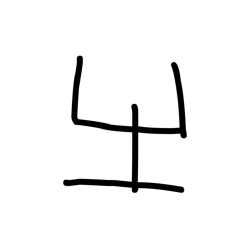

- source_zip_member: `Sub-character Images/0uhj5zj3ce/0uhj5zj3ce/bg1yr1ixw9.png`
- checksum_sha256: see `06_component-visual-index.csv`.
- review_status: `needs_human_visual_review`
- caution: source-marked review image only.

## asset-020890

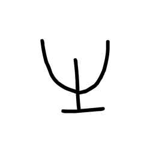

- source_zip_member: `Sub-character Images/0uhj5zj3ce/0uhj5zj3ce/d67iuffkfk.png`
- checksum_sha256: see `06_component-visual-index.csv`.
- review_status: `needs_human_visual_review`
- caution: source-marked review image only.

## asset-020891

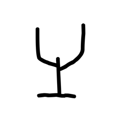

- source_zip_member: `Sub-character Images/0uhj5zj3ce/0uhj5zj3ce/h3j5w39xwq.png`
- checksum_sha256: see `06_component-visual-index.csv`.
- review_status: `needs_human_visual_review`
- caution: source-marked review image only.

## asset-020892

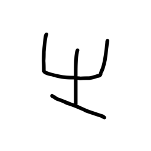

- source_zip_member: `Sub-character Images/0uhj5zj3ce/0uhj5zj3ce/ha30l500o6.png`
- checksum_sha256: see `06_component-visual-index.csv`.
- review_status: `needs_human_visual_review`
- caution: source-marked review image only.

## asset-020893

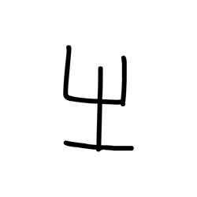

- source_zip_member: `Sub-character Images/0uhj5zj3ce/0uhj5zj3ce/jn2dh1hrnn.png`
- checksum_sha256: see `06_component-visual-index.csv`.
- review_status: `needs_human_visual_review`
- caution: source-marked review image only.

## asset-020894

- source_zip_member: `Sub-character Images/0uhj5zj3ce/0uhj5zj3ce/vnhqzuljc7.png`
- checksum_sha256: see `06_component-visual-index.csv`.
- review_status: `needs_human_visual_review`
- caution: source-marked review image only.

## asset-020895

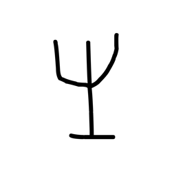

- source_zip_member: `Sub-character Images/0uhj5zj3ce/0uhj5zj3ce/wto4g8us4s.png`
- checksum_sha256: see `06_component-visual-index.csv`.
- review_status: `needs_human_visual_review`
- caution: source-marked review image only.

## asset-020896

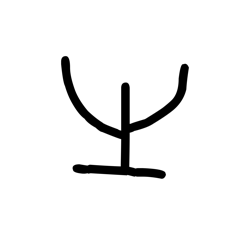

- source_zip_member: `Sub-character Images/0uhj5zj3ce/0uhj5zj3ce/zd09ofa7cs.png`
- checksum_sha256: see `06_component-visual-index.csv`.
- review_status: `needs_human_visual_review`
- caution: source-marked review image only.

## asset-020897

- source_zip_member: `Sub-character Images/0uhj5zj3ce/0uhj5zj3ce/zj5owqb8lo.png`
- checksum_sha256: see `06_component-visual-index.csv`.
- review_status: `needs_human_visual_review`
- caution: source-marked review image only.

## asset-020898

- source_zip_member: `Sub-character Images/0uhj5zj3ce/0uhj5zj3ce/zmslxclxat.png`
- checksum_sha256: see `06_component-visual-index.csv`.
- review_status: `needs_human_visual_review`
- caution: source-marked review image only.
