# Component Visual Gallery / 构件图像查看: obs-comp-cand-002524

English:
This page displays OBIMD subcharacter PNG assets extracted into this concrete corpus object directory for human review.

简体中文：
本页展示抽取到当前具体 corpus 对象目录内的 OBIMD subcharacter PNG 资料，供人工复核使用。

Boundary / 边界：dataset image candidate only; not a confirmed component form, component assignment, or decipherment claim.

## asset-020914

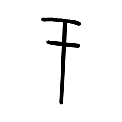

- source_zip_member: `Sub-character Images/jjm889wxay/jjm889wxay/2b1hnrki1y.png`
- checksum_sha256: `4c81c206971565d710fe152c70692cae325ea95d4bb38a363c0b35a17520d77f`
- review_status: `needs_human_visual_review`
- caution: OBIMD subcharacter image is a source-marked review asset only; it is not a confirmed component form, component assignment, or decipherment conclusion.

## asset-020915

- source_zip_member: `Sub-character Images/jjm889wxay/jjm889wxay/2cs7paiaws.png`
- checksum_sha256: `c56adb0b80acaafe29ac6a1204f80ab07ca477b27e312bd5370ca455544bb007`
- review_status: `needs_human_visual_review`
- caution: OBIMD subcharacter image is a source-marked review asset only; it is not a confirmed component form, component assignment, or decipherment conclusion.

## asset-020916

- source_zip_member: `Sub-character Images/jjm889wxay/jjm889wxay/2qrfvr85k8.png`
- checksum_sha256: `0bfc78aa564e9eacb96f9bd575dc32023c7dc1445c4fda6e3f1eaa90422c17e7`
- review_status: `needs_human_visual_review`
- caution: OBIMD subcharacter image is a source-marked review asset only; it is not a confirmed component form, component assignment, or decipherment conclusion.

## asset-020917

- source_zip_member: `Sub-character Images/jjm889wxay/jjm889wxay/32j9i24y3j.png`
- checksum_sha256: `146d264023fbbe7f2c296d9895bc2c93e067d1cd961983a8e1d738622ad4fb9c`
- review_status: `needs_human_visual_review`
- caution: OBIMD subcharacter image is a source-marked review asset only; it is not a confirmed component form, component assignment, or decipherment conclusion.

## asset-020918

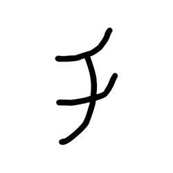

- source_zip_member: `Sub-character Images/jjm889wxay/jjm889wxay/3ege7067pt.png`
- checksum_sha256: `ae93ec0d5436fdd03a00cdfcbe5576849151ff914a831e31c641a651ea1f0806`
- review_status: `needs_human_visual_review`
- caution: OBIMD subcharacter image is a source-marked review asset only; it is not a confirmed component form, component assignment, or decipherment conclusion.

## asset-020919

- source_zip_member: `Sub-character Images/jjm889wxay/jjm889wxay/5in4al22kn.png`
- checksum_sha256: `2f6e983f0cafcfe3a1e1112ad7f5fb5be98720671ae8b089625b367f8122184b`
- review_status: `needs_human_visual_review`
- caution: OBIMD subcharacter image is a source-marked review asset only; it is not a confirmed component form, component assignment, or decipherment conclusion.

## asset-020920

- source_zip_member: `Sub-character Images/jjm889wxay/jjm889wxay/6a9a4v4z2h.png`
- checksum_sha256: `fff2f180fefd3a964e76310b935a3832ef0456f29a168164a77d8626fc1b501c`
- review_status: `needs_human_visual_review`
- caution: OBIMD subcharacter image is a source-marked review asset only; it is not a confirmed component form, component assignment, or decipherment conclusion.

## asset-020921

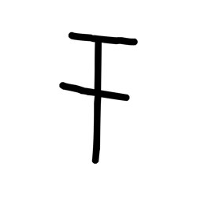

- source_zip_member: `Sub-character Images/jjm889wxay/jjm889wxay/6ks3cudg6z.png`
- checksum_sha256: `8ebfc034c1389ac1c324cbea329a72f33d127df53909f3086941e28fe026ae36`
- review_status: `needs_human_visual_review`
- caution: OBIMD subcharacter image is a source-marked review asset only; it is not a confirmed component form, component assignment, or decipherment conclusion.

## asset-020922

- source_zip_member: `Sub-character Images/jjm889wxay/jjm889wxay/7t3mw4q0hd.png`
- checksum_sha256: `cffc8ea995c7f555ab14d38c0b550546c107e6b6ccbecbf8594163d4ab60d34c`
- review_status: `needs_human_visual_review`
- caution: OBIMD subcharacter image is a source-marked review asset only; it is not a confirmed component form, component assignment, or decipherment conclusion.

## asset-020923

- source_zip_member: `Sub-character Images/jjm889wxay/jjm889wxay/7u5ana7pfi.png`
- checksum_sha256: `a5aef0006f71a7aab8c345bb659947a7c3e7b31679b0b779183f87927d0dc601`
- review_status: `needs_human_visual_review`
- caution: OBIMD subcharacter image is a source-marked review asset only; it is not a confirmed component form, component assignment, or decipherment conclusion.

## asset-020924

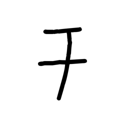

- source_zip_member: `Sub-character Images/jjm889wxay/jjm889wxay/86jeptl2s8.png`
- checksum_sha256: `94334f1fe0293d3360b6e2a2e8742a3997b8c08d951e88c13b78185f4782278c`
- review_status: `needs_human_visual_review`
- caution: OBIMD subcharacter image is a source-marked review asset only; it is not a confirmed component form, component assignment, or decipherment conclusion.

## asset-020925

- source_zip_member: `Sub-character Images/jjm889wxay/jjm889wxay/8g1g44xink.png`
- checksum_sha256: `840b5d66a84c20b7415b017f8e31f97b56e8d3c934a32ec1d3028a225b1106d5`
- review_status: `needs_human_visual_review`
- caution: OBIMD subcharacter image is a source-marked review asset only; it is not a confirmed component form, component assignment, or decipherment conclusion.

## asset-020926

- source_zip_member: `Sub-character Images/jjm889wxay/jjm889wxay/90ncbmhav0.png`
- checksum_sha256: `4205b977108ee97fa4e6de4b828f1433669d4f1554301d0e664213fa4586396b`
- review_status: `needs_human_visual_review`
- caution: OBIMD subcharacter image is a source-marked review asset only; it is not a confirmed component form, component assignment, or decipherment conclusion.

## asset-020927

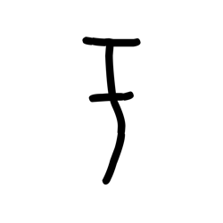

- source_zip_member: `Sub-character Images/jjm889wxay/jjm889wxay/9gomss6c7c.png`
- checksum_sha256: `be5bdd3fceeb1bfb22e60aad8f69a303cf27e9c989d39ebaa69307e155bf7942`
- review_status: `needs_human_visual_review`
- caution: OBIMD subcharacter image is a source-marked review asset only; it is not a confirmed component form, component assignment, or decipherment conclusion.

## asset-020928

- source_zip_member: `Sub-character Images/jjm889wxay/jjm889wxay/a0k0cdrv0a.png`
- checksum_sha256: `9ea3c699925346d564a949a21fc77e0dde7def1f667f13c51e6d86153cdbc997`
- review_status: `needs_human_visual_review`
- caution: OBIMD subcharacter image is a source-marked review asset only; it is not a confirmed component form, component assignment, or decipherment conclusion.

## asset-020929

- source_zip_member: `Sub-character Images/jjm889wxay/jjm889wxay/a3vvicf0n0.png`
- checksum_sha256: `5ac9fbc6beda0bc9bed0e1fa546dbde2321da7956abe2fcabe94e6b9f9b018e6`
- review_status: `needs_human_visual_review`
- caution: OBIMD subcharacter image is a source-marked review asset only; it is not a confirmed component form, component assignment, or decipherment conclusion.

## asset-020930

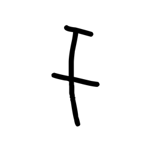

- source_zip_member: `Sub-character Images/jjm889wxay/jjm889wxay/ae7qz80p00.png`
- checksum_sha256: `4d9bc17d56010ecba73c6eecb6ed350bcff07fb3b271b4394ed3c3cd3a46b3d9`
- review_status: `needs_human_visual_review`
- caution: OBIMD subcharacter image is a source-marked review asset only; it is not a confirmed component form, component assignment, or decipherment conclusion.

## asset-020931

- source_zip_member: `Sub-character Images/jjm889wxay/jjm889wxay/affp1azn3a.png`
- checksum_sha256: `c59eda3665cb826883b86e02e25cf710328acd18d6ee9cb742cbbb8594fa5991`
- review_status: `needs_human_visual_review`
- caution: OBIMD subcharacter image is a source-marked review asset only; it is not a confirmed component form, component assignment, or decipherment conclusion.

## asset-020932

- source_zip_member: `Sub-character Images/jjm889wxay/jjm889wxay/byhs5j950i.png`
- checksum_sha256: `232561be56353551a0c063c34f70712a907c2c7c35527b3dda8b3577bdc80966`
- review_status: `needs_human_visual_review`
- caution: OBIMD subcharacter image is a source-marked review asset only; it is not a confirmed component form, component assignment, or decipherment conclusion.

## asset-020933

- source_zip_member: `Sub-character Images/jjm889wxay/jjm889wxay/c0cnjz7vzp.png`
- checksum_sha256: `b5737557965fdc783c910d9244f5ce46de043c5fcaa7a7fc9776281a3349819c`
- review_status: `needs_human_visual_review`
- caution: OBIMD subcharacter image is a source-marked review asset only; it is not a confirmed component form, component assignment, or decipherment conclusion.

## asset-020934

- source_zip_member: `Sub-character Images/jjm889wxay/jjm889wxay/c3d4x2coo2.png`
- checksum_sha256: `5f07a727b3df60b3d471fd1d2e480035965e1ecdeb65a0fe29757d67265cb35a`
- review_status: `needs_human_visual_review`
- caution: OBIMD subcharacter image is a source-marked review asset only; it is not a confirmed component form, component assignment, or decipherment conclusion.

## asset-020935

- source_zip_member: `Sub-character Images/jjm889wxay/jjm889wxay/dhaj4cxwqa.png`
- checksum_sha256: `b0311797deca3f897b0429eb22ee206b6136ba01534893ca121552e7cab06327`
- review_status: `needs_human_visual_review`
- caution: OBIMD subcharacter image is a source-marked review asset only; it is not a confirmed component form, component assignment, or decipherment conclusion.

## asset-020936

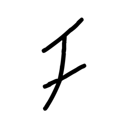

- source_zip_member: `Sub-character Images/jjm889wxay/jjm889wxay/e7r1ycwc6n.png`
- checksum_sha256: `ade58daa64e739f20bc656d9b78752201092185803fdf5ab0846f46cf9ed7b7a`
- review_status: `needs_human_visual_review`
- caution: OBIMD subcharacter image is a source-marked review asset only; it is not a confirmed component form, component assignment, or decipherment conclusion.

## asset-020937

- source_zip_member: `Sub-character Images/jjm889wxay/jjm889wxay/eh3pkiz6bv.png`
- checksum_sha256: `159b6b0719c2ec752fe6494a49bb235396b2d121f5867a73dfaf3606af3bc0d1`
- review_status: `needs_human_visual_review`
- caution: OBIMD subcharacter image is a source-marked review asset only; it is not a confirmed component form, component assignment, or decipherment conclusion.

## asset-020938

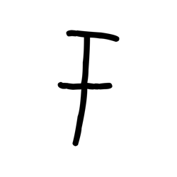

- source_zip_member: `Sub-character Images/jjm889wxay/jjm889wxay/el75pwkdj2.png`
- checksum_sha256: `ee09277cf0f0295e45833d8c9ef9f2c0539ba286fd5184695df69b597d63692a`
- review_status: `needs_human_visual_review`
- caution: OBIMD subcharacter image is a source-marked review asset only; it is not a confirmed component form, component assignment, or decipherment conclusion.

## asset-020939

- source_zip_member: `Sub-character Images/jjm889wxay/jjm889wxay/f7igpayix0.png`
- checksum_sha256: `96e678f8074fc4d929aef707e564eaba1dca8d5d2135eff37061f1524a83a2d9`
- review_status: `needs_human_visual_review`
- caution: OBIMD subcharacter image is a source-marked review asset only; it is not a confirmed component form, component assignment, or decipherment conclusion.

## asset-020940

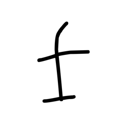

- source_zip_member: `Sub-character Images/jjm889wxay/jjm889wxay/f92hximf33.png`
- checksum_sha256: `f76afdf8c65440351a91bd1505d5f016fb88abae11f67f0d935b0a6923b2a779`
- review_status: `needs_human_visual_review`
- caution: OBIMD subcharacter image is a source-marked review asset only; it is not a confirmed component form, component assignment, or decipherment conclusion.

## asset-020941

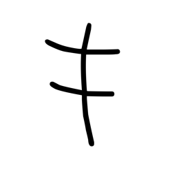

- source_zip_member: `Sub-character Images/jjm889wxay/jjm889wxay/fao3k8k5am.png`
- checksum_sha256: `ec3a476fba7c96ca7b1d52dde0f0d6ee333d0f87b07bd669e6d23d4a8f830db6`
- review_status: `needs_human_visual_review`
- caution: OBIMD subcharacter image is a source-marked review asset only; it is not a confirmed component form, component assignment, or decipherment conclusion.

## asset-020942

- source_zip_member: `Sub-character Images/jjm889wxay/jjm889wxay/fbxi62c3se.png`
- checksum_sha256: `9502d9d973d1ded08e9f5b970c150f2cec8003cb65543d3e501aa3ccf192ea85`
- review_status: `needs_human_visual_review`
- caution: OBIMD subcharacter image is a source-marked review asset only; it is not a confirmed component form, component assignment, or decipherment conclusion.

## asset-020943

- source_zip_member: `Sub-character Images/jjm889wxay/jjm889wxay/fg6gh08ts1.png`
- checksum_sha256: `12447bea7d4663fcb2c2894e9ced5ddc2ab79966b4e92d79ca8e5e48ed09df7b`
- review_status: `needs_human_visual_review`
- caution: OBIMD subcharacter image is a source-marked review asset only; it is not a confirmed component form, component assignment, or decipherment conclusion.

## asset-020944

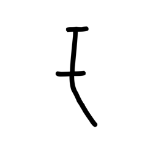

- source_zip_member: `Sub-character Images/jjm889wxay/jjm889wxay/g01p13yslq.png`
- checksum_sha256: `0ba4b5008c9e2bdd03ca47c49f34153fdd32116bb19d2f9864d1fca89b2936c2`
- review_status: `needs_human_visual_review`
- caution: OBIMD subcharacter image is a source-marked review asset only; it is not a confirmed component form, component assignment, or decipherment conclusion.

## asset-020945

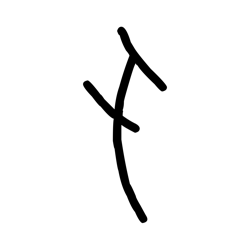

- source_zip_member: `Sub-character Images/jjm889wxay/jjm889wxay/g1vm2d9cdv.png`
- checksum_sha256: `776cfe174800017be8551b4a0e73fb056a3ac1cf8ffbeeb3b2c7137ea6d6bd47`
- review_status: `needs_human_visual_review`
- caution: OBIMD subcharacter image is a source-marked review asset only; it is not a confirmed component form, component assignment, or decipherment conclusion.

## asset-020946

- source_zip_member: `Sub-character Images/jjm889wxay/jjm889wxay/g3lmv1z2xc.png`
- checksum_sha256: `8aeb35cdae1a84b7fe013cc2a7f646718eb9937bb6bbf928ecca1dcf40f40b2e`
- review_status: `needs_human_visual_review`
- caution: OBIMD subcharacter image is a source-marked review asset only; it is not a confirmed component form, component assignment, or decipherment conclusion.

## asset-020947

- source_zip_member: `Sub-character Images/jjm889wxay/jjm889wxay/g53jfktmvc.png`
- checksum_sha256: `a0d4805652119382db7207a886c95ce41c6cd9a5a018ebfd722c7f2b5c907b43`
- review_status: `needs_human_visual_review`
- caution: OBIMD subcharacter image is a source-marked review asset only; it is not a confirmed component form, component assignment, or decipherment conclusion.

## asset-020948

- source_zip_member: `Sub-character Images/jjm889wxay/jjm889wxay/h6ydb42odr.png`
- checksum_sha256: `30809696aceb991a5381650001c1ea9e076182fc01b97a122767f3c2c713f28b`
- review_status: `needs_human_visual_review`
- caution: OBIMD subcharacter image is a source-marked review asset only; it is not a confirmed component form, component assignment, or decipherment conclusion.

## asset-020949

- source_zip_member: `Sub-character Images/jjm889wxay/jjm889wxay/h7s6n00f27.png`
- checksum_sha256: `e0fa0df3b459b3827babf4dfda87cb434215a8d65f5f8a1d9264558da56ed060`
- review_status: `needs_human_visual_review`
- caution: OBIMD subcharacter image is a source-marked review asset only; it is not a confirmed component form, component assignment, or decipherment conclusion.

## asset-020950

- source_zip_member: `Sub-character Images/jjm889wxay/jjm889wxay/hp0bxrttdm.png`
- checksum_sha256: `77b261b6e2f8520ef21c9c56b1258be1957aaefe16440625e93185dbbd401f86`
- review_status: `needs_human_visual_review`
- caution: OBIMD subcharacter image is a source-marked review asset only; it is not a confirmed component form, component assignment, or decipherment conclusion.

## asset-020951

- source_zip_member: `Sub-character Images/jjm889wxay/jjm889wxay/hr0srvwx3y.png`
- checksum_sha256: `dc9e5965e1380a39d4a0ce686158c5e5d415139dee7a13b41b2611fbdff3e56b`
- review_status: `needs_human_visual_review`
- caution: OBIMD subcharacter image is a source-marked review asset only; it is not a confirmed component form, component assignment, or decipherment conclusion.

## asset-020952

- source_zip_member: `Sub-character Images/jjm889wxay/jjm889wxay/iuw75t11n6.png`
- checksum_sha256: `70988b4afed17f6e37a09e978e51ef3b91eb52e11df253429ebb693e4cc5e2a1`
- review_status: `needs_human_visual_review`
- caution: OBIMD subcharacter image is a source-marked review asset only; it is not a confirmed component form, component assignment, or decipherment conclusion.

## asset-020953

- source_zip_member: `Sub-character Images/jjm889wxay/jjm889wxay/j24aa6zagf.png`
- checksum_sha256: `eedc8a0b9b556e98c7fe5ca5627b5c6812a6a8995f42c6429bb7d4974b140720`
- review_status: `needs_human_visual_review`
- caution: OBIMD subcharacter image is a source-marked review asset only; it is not a confirmed component form, component assignment, or decipherment conclusion.

## asset-020954

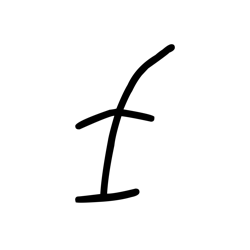

- source_zip_member: `Sub-character Images/jjm889wxay/jjm889wxay/jj3em8bojh.png`
- checksum_sha256: `bc14c564431c20a6e98062ec872a1aab19b8781c49f5e088c586fa0c5b35a952`
- review_status: `needs_human_visual_review`
- caution: OBIMD subcharacter image is a source-marked review asset only; it is not a confirmed component form, component assignment, or decipherment conclusion.

## asset-020955

- source_zip_member: `Sub-character Images/jjm889wxay/jjm889wxay/jjm889wxay.png`
- checksum_sha256: `26434bfadf4b584368f4c996b3ce266dadb77cbe3e7976eaa2a260682101652e`
- review_status: `needs_human_visual_review`
- caution: OBIMD subcharacter image is a source-marked review asset only; it is not a confirmed component form, component assignment, or decipherment conclusion.

## asset-020956

- source_zip_member: `Sub-character Images/jjm889wxay/jjm889wxay/juafa4xd7g.png`
- checksum_sha256: `1864b6c0b97476233de2ff510cee40e34755b21d19cd036dc8814b5328f354b9`
- review_status: `needs_human_visual_review`
- caution: OBIMD subcharacter image is a source-marked review asset only; it is not a confirmed component form, component assignment, or decipherment conclusion.

## asset-020957

- source_zip_member: `Sub-character Images/jjm889wxay/jjm889wxay/ke7kldnzzo.png`
- checksum_sha256: `0db1b043d0cf8492e6812e8965abdee8d2c0f67da126ee1b7b5ed3c57bae0637`
- review_status: `needs_human_visual_review`
- caution: OBIMD subcharacter image is a source-marked review asset only; it is not a confirmed component form, component assignment, or decipherment conclusion.

## asset-020958

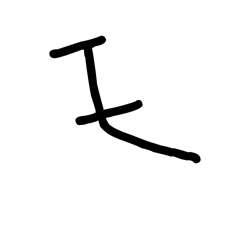

- source_zip_member: `Sub-character Images/jjm889wxay/jjm889wxay/lzolvyxk1p.png`
- checksum_sha256: `2f32524b5004d36bcb417f8aefe4ee30b4db52cb4e0a364554ac63d1dd8fc03d`
- review_status: `needs_human_visual_review`
- caution: OBIMD subcharacter image is a source-marked review asset only; it is not a confirmed component form, component assignment, or decipherment conclusion.

## asset-020959

- source_zip_member: `Sub-character Images/jjm889wxay/jjm889wxay/mf1goz7hf5.png`
- checksum_sha256: `a1af2463be09d25de919e4a3aeaf8807ec7a9c5aa58a9fb0ec446c5a986e7040`
- review_status: `needs_human_visual_review`
- caution: OBIMD subcharacter image is a source-marked review asset only; it is not a confirmed component form, component assignment, or decipherment conclusion.

## asset-020960

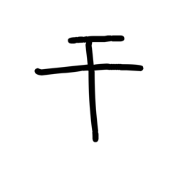

- source_zip_member: `Sub-character Images/jjm889wxay/jjm889wxay/mkx4r0zn6e.png`
- checksum_sha256: `1b0ec8c484ea123488b74c8a87f45b1b3ee20a9efe828998e40a098fbc09d2b0`
- review_status: `needs_human_visual_review`
- caution: OBIMD subcharacter image is a source-marked review asset only; it is not a confirmed component form, component assignment, or decipherment conclusion.

## asset-020961

- source_zip_member: `Sub-character Images/jjm889wxay/jjm889wxay/mystd2z5dr.png`
- checksum_sha256: `353ccaf19a6b16d973b2a9161072f6acb62e61b01dbef940a229a728b7fe96ef`
- review_status: `needs_human_visual_review`
- caution: OBIMD subcharacter image is a source-marked review asset only; it is not a confirmed component form, component assignment, or decipherment conclusion.

## asset-020962

- source_zip_member: `Sub-character Images/jjm889wxay/jjm889wxay/nkd69hbqfg.png`
- checksum_sha256: `f038a94acad478788c2894a25dfa350d7e63ee3be62f892f3883dd2fae1d4036`
- review_status: `needs_human_visual_review`
- caution: OBIMD subcharacter image is a source-marked review asset only; it is not a confirmed component form, component assignment, or decipherment conclusion.

## asset-020963

- source_zip_member: `Sub-character Images/jjm889wxay/jjm889wxay/nuafp0wr04.png`
- checksum_sha256: `d6856ac0aec4428f28af43274aa1e14900b8ea125104158aa51d3412aea0ec4a`
- review_status: `needs_human_visual_review`
- caution: OBIMD subcharacter image is a source-marked review asset only; it is not a confirmed component form, component assignment, or decipherment conclusion.

## asset-020964

- source_zip_member: `Sub-character Images/jjm889wxay/jjm889wxay/oj2i9omemi.png`
- checksum_sha256: `f2ab7042e8ee82fc72b53f72d306f411e112e856500f9b88ed5afd6a2c3c3f1a`
- review_status: `needs_human_visual_review`
- caution: OBIMD subcharacter image is a source-marked review asset only; it is not a confirmed component form, component assignment, or decipherment conclusion.

## asset-020965

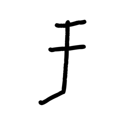

- source_zip_member: `Sub-character Images/jjm889wxay/jjm889wxay/patqwtihar.png`
- checksum_sha256: `dcc9f8832075d5435dd9acfcd77ae9886182cc2db6c101a9187c83d8d337a6e8`
- review_status: `needs_human_visual_review`
- caution: OBIMD subcharacter image is a source-marked review asset only; it is not a confirmed component form, component assignment, or decipherment conclusion.

## asset-020966

- source_zip_member: `Sub-character Images/jjm889wxay/jjm889wxay/pgml6ogl8z.png`
- checksum_sha256: `95129896c74d272f69a9809fe3995bc0df106a2f523eb5718b67d701fe11a2d3`
- review_status: `needs_human_visual_review`
- caution: OBIMD subcharacter image is a source-marked review asset only; it is not a confirmed component form, component assignment, or decipherment conclusion.

## asset-020967

- source_zip_member: `Sub-character Images/jjm889wxay/jjm889wxay/qdbme23bmq.png`
- checksum_sha256: `b7b82b336ffb2107a4944e8040bf85891eb165671ff6ff00e75a1f72fed8bdf6`
- review_status: `needs_human_visual_review`
- caution: OBIMD subcharacter image is a source-marked review asset only; it is not a confirmed component form, component assignment, or decipherment conclusion.

## asset-020968

- source_zip_member: `Sub-character Images/jjm889wxay/jjm889wxay/qmjug8g4ib.png`
- checksum_sha256: `34041f32c2639a54b92cb23ae949c8e710fa283331822101263b9ab99aff5a37`
- review_status: `needs_human_visual_review`
- caution: OBIMD subcharacter image is a source-marked review asset only; it is not a confirmed component form, component assignment, or decipherment conclusion.

## asset-020969

- source_zip_member: `Sub-character Images/jjm889wxay/jjm889wxay/s3rqw3y4gj.png`
- checksum_sha256: `f9d0704a468c9745edf88ab954234b937af2d832ef080fdfcb41ccae9bf0fb7a`
- review_status: `needs_human_visual_review`
- caution: OBIMD subcharacter image is a source-marked review asset only; it is not a confirmed component form, component assignment, or decipherment conclusion.

## asset-020970

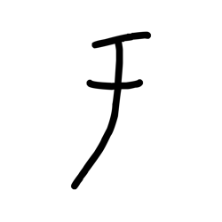

- source_zip_member: `Sub-character Images/jjm889wxay/jjm889wxay/sa1xjnh4qn.png`
- checksum_sha256: `97f2af042bbd3fcf2237c73bf8f40b75de3e798ad5fc8ce96b420650020a32a7`
- review_status: `needs_human_visual_review`
- caution: OBIMD subcharacter image is a source-marked review asset only; it is not a confirmed component form, component assignment, or decipherment conclusion.

## asset-020971

- source_zip_member: `Sub-character Images/jjm889wxay/jjm889wxay/siff034ty9.png`
- checksum_sha256: `e9b5fbca6af86bf333a41efe51d14aad58f8e973e7201be82aaccb07f3efcf54`
- review_status: `needs_human_visual_review`
- caution: OBIMD subcharacter image is a source-marked review asset only; it is not a confirmed component form, component assignment, or decipherment conclusion.

## asset-020972

- source_zip_member: `Sub-character Images/jjm889wxay/jjm889wxay/sxzcj1tp2d.png`
- checksum_sha256: `ccf121d7eb1adbea60b3902356dbaf9a41811e9eef8ef07d03808f59863f9fbb`
- review_status: `needs_human_visual_review`
- caution: OBIMD subcharacter image is a source-marked review asset only; it is not a confirmed component form, component assignment, or decipherment conclusion.

## asset-020973

- source_zip_member: `Sub-character Images/jjm889wxay/jjm889wxay/tp1ljbovev.png`
- checksum_sha256: `7df3b016afa2e6515d15add88b7ac9fd876b56a761c97bd967419de2c8de76bf`
- review_status: `needs_human_visual_review`
- caution: OBIMD subcharacter image is a source-marked review asset only; it is not a confirmed component form, component assignment, or decipherment conclusion.

## asset-020974

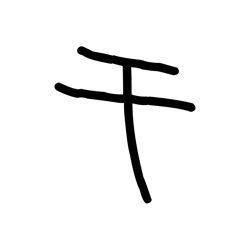

- source_zip_member: `Sub-character Images/jjm889wxay/jjm889wxay/tr2l5ot14x.png`
- checksum_sha256: `bd3875b7888844aa305ded6c58ead355275cf4be7273613520f06550695fb04e`
- review_status: `needs_human_visual_review`
- caution: OBIMD subcharacter image is a source-marked review asset only; it is not a confirmed component form, component assignment, or decipherment conclusion.

## asset-020975

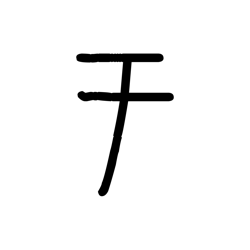

- source_zip_member: `Sub-character Images/jjm889wxay/jjm889wxay/u1fo5tgdft.png`
- checksum_sha256: `3ad203110c10dc407255e42b65b696d6699db9c2f14eb3921c58149e3203c72d`
- review_status: `needs_human_visual_review`
- caution: OBIMD subcharacter image is a source-marked review asset only; it is not a confirmed component form, component assignment, or decipherment conclusion.

## asset-020976

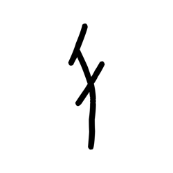

- source_zip_member: `Sub-character Images/jjm889wxay/jjm889wxay/uluqs0alox.png`
- checksum_sha256: `98d33b6855f77f2df7f33ce643d7eef5e6d5b407b4aad20491886d92e56cdc21`
- review_status: `needs_human_visual_review`
- caution: OBIMD subcharacter image is a source-marked review asset only; it is not a confirmed component form, component assignment, or decipherment conclusion.

## asset-020977

- source_zip_member: `Sub-character Images/jjm889wxay/jjm889wxay/v8sgjrn39e.png`
- checksum_sha256: `8c058fe5998dc597efae5d6f7fd97abaaa66f7683ff1ea36330b14773beb8d2e`
- review_status: `needs_human_visual_review`
- caution: OBIMD subcharacter image is a source-marked review asset only; it is not a confirmed component form, component assignment, or decipherment conclusion.

## asset-020978

- source_zip_member: `Sub-character Images/jjm889wxay/jjm889wxay/vh5tlwomqb.png`
- checksum_sha256: `80729f1d701fd3ed1942b869679238e078246362050048721ae63c5e92ebffbf`
- review_status: `needs_human_visual_review`
- caution: OBIMD subcharacter image is a source-marked review asset only; it is not a confirmed component form, component assignment, or decipherment conclusion.

## asset-020979

- source_zip_member: `Sub-character Images/jjm889wxay/jjm889wxay/wsuzl0q8dl.png`
- checksum_sha256: `7426eb2c43e322251e9eef0d80e0654441fa69041526293f8557caaeeff0a867`
- review_status: `needs_human_visual_review`
- caution: OBIMD subcharacter image is a source-marked review asset only; it is not a confirmed component form, component assignment, or decipherment conclusion.

## asset-020980

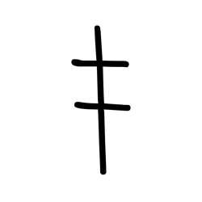

- source_zip_member: `Sub-character Images/jjm889wxay/jjm889wxay/wt3fgmsgsz.png`
- checksum_sha256: `0f744ebaaf2888d8a84f0caa0edcfb757e1867be80578b3d975a5b1ac057efc8`
- review_status: `needs_human_visual_review`
- caution: OBIMD subcharacter image is a source-marked review asset only; it is not a confirmed component form, component assignment, or decipherment conclusion.

## asset-020981

- source_zip_member: `Sub-character Images/jjm889wxay/jjm889wxay/x2gqpotzcy.png`
- checksum_sha256: `528224ea1082dc5b1908852c320ccfe89cd23e65a0fda58569b192a32b7a9036`
- review_status: `needs_human_visual_review`
- caution: OBIMD subcharacter image is a source-marked review asset only; it is not a confirmed component form, component assignment, or decipherment conclusion.

## asset-020982

- source_zip_member: `Sub-character Images/jjm889wxay/jjm889wxay/zmktt6en4x.png`
- checksum_sha256: `cae1c6055d601cb967eb6631ae25e801d7f09288b2a1bfcb673784fff9124db5`
- review_status: `needs_human_visual_review`
- caution: OBIMD subcharacter image is a source-marked review asset only; it is not a confirmed component form, component assignment, or decipherment conclusion.
