# Component Visual Gallery / 构件图像查看: obs-comp-cand-002545

English:
This page displays OBIMD subcharacter PNG assets extracted into this concrete corpus object directory for human review.

简体中文：
本页展示抽取到当前具体 corpus 对象目录内的 OBIMD subcharacter PNG 资料，供人工复核使用。

Boundary / 边界：dataset image candidate only; not a confirmed component form, component assignment, or decipherment claim.

## asset-021064

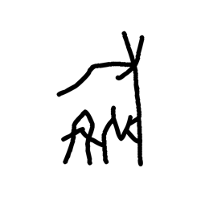

- source_zip_member: `Sub-character Images/7bgm052mqy/7bgm052mqy/1cjsy1vq9c.png`
- checksum_sha256: `e694f13a288c794da9d03ea8855aa6125481873f3a5954bae37c4e12820e1574`
- review_status: `needs_human_visual_review`
- caution: OBIMD subcharacter image is a source-marked review asset only; it is not a confirmed component form, component assignment, or decipherment conclusion.

## asset-021065

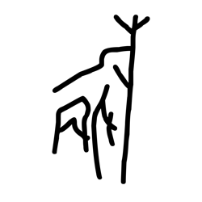

- source_zip_member: `Sub-character Images/7bgm052mqy/7bgm052mqy/47z3vuek8p.png`
- checksum_sha256: `13faf4620021cebdcf14593acd35506032c18ef9453177b05992c1352ada98a9`
- review_status: `needs_human_visual_review`
- caution: OBIMD subcharacter image is a source-marked review asset only; it is not a confirmed component form, component assignment, or decipherment conclusion.

## asset-021066

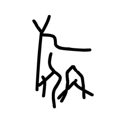

- source_zip_member: `Sub-character Images/7bgm052mqy/7bgm052mqy/699ryzkkdu.png`
- checksum_sha256: `554359f40dc9d9ab566717b823d76055a615ea155258f2a40af755f116007fac`
- review_status: `needs_human_visual_review`
- caution: OBIMD subcharacter image is a source-marked review asset only; it is not a confirmed component form, component assignment, or decipherment conclusion.

## asset-021067

- source_zip_member: `Sub-character Images/7bgm052mqy/7bgm052mqy/7bgm052mqy.png`
- checksum_sha256: `16374b921681d9989ca1a9e42fdacae04b1adea76fdf549efe4f11a267ce94e0`
- review_status: `needs_human_visual_review`
- caution: OBIMD subcharacter image is a source-marked review asset only; it is not a confirmed component form, component assignment, or decipherment conclusion.

## asset-021068

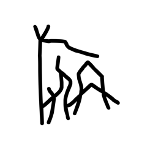

- source_zip_member: `Sub-character Images/7bgm052mqy/7bgm052mqy/a57so8qpu0.png`
- checksum_sha256: `00a526a651eeb21ad137ff3cddb8dbb899f25509c812e38cb1d2bc692e5039b7`
- review_status: `needs_human_visual_review`
- caution: OBIMD subcharacter image is a source-marked review asset only; it is not a confirmed component form, component assignment, or decipherment conclusion.

## asset-021069

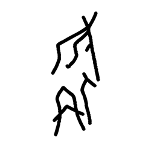

- source_zip_member: `Sub-character Images/7bgm052mqy/7bgm052mqy/oxanltnhz8.png`
- checksum_sha256: `d40875541b1c071bb7cfc7a4c7999ac72373cdc1e1fa026bae02e4ac25b19217`
- review_status: `needs_human_visual_review`
- caution: OBIMD subcharacter image is a source-marked review asset only; it is not a confirmed component form, component assignment, or decipherment conclusion.

## asset-021070

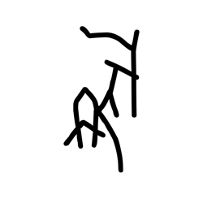

- source_zip_member: `Sub-character Images/7bgm052mqy/7bgm052mqy/q7ziji3557.png`
- checksum_sha256: `5c8b1f9a95c8a8b131d4a851fc1a2ab21a9a206923f3dd4839df0be738496021`
- review_status: `needs_human_visual_review`
- caution: OBIMD subcharacter image is a source-marked review asset only; it is not a confirmed component form, component assignment, or decipherment conclusion.

## asset-021071

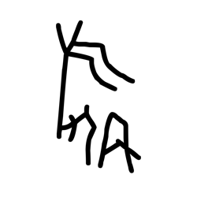

- source_zip_member: `Sub-character Images/7bgm052mqy/7bgm052mqy/qdhlycjqp3.png`
- checksum_sha256: `e48dcd7c5048fca103d5ca970ba78227d199f7fab5736e7d90533fd681935c90`
- review_status: `needs_human_visual_review`
- caution: OBIMD subcharacter image is a source-marked review asset only; it is not a confirmed component form, component assignment, or decipherment conclusion.

## asset-021072

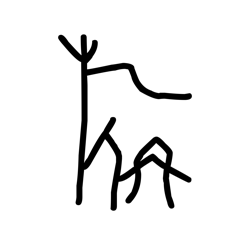

- source_zip_member: `Sub-character Images/7bgm052mqy/7bgm052mqy/talakvz29k.png`
- checksum_sha256: `5f7e97d2c57743fb4871c15914a042110903e52cb4fd7b73e62c6e6d677b43ed`
- review_status: `needs_human_visual_review`
- caution: OBIMD subcharacter image is a source-marked review asset only; it is not a confirmed component form, component assignment, or decipherment conclusion.

## asset-021073

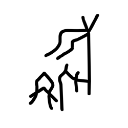

- source_zip_member: `Sub-character Images/7bgm052mqy/7bgm052mqy/wzen3vk690.png`
- checksum_sha256: `e86827a542759feaeec02cd55af0d51465dcd17a7c4bb1bec06856c0133f95f3`
- review_status: `needs_human_visual_review`
- caution: OBIMD subcharacter image is a source-marked review asset only; it is not a confirmed component form, component assignment, or decipherment conclusion.

## asset-021074

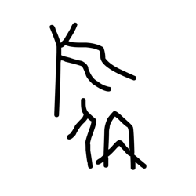

- source_zip_member: `Sub-character Images/7bgm052mqy/7bgm052mqy/xw85tfrepu.png`
- checksum_sha256: `8b919e6f3002db83e35a483606bd5429d5b35c31f73eab9c64e94d1b708cb246`
- review_status: `needs_human_visual_review`
- caution: OBIMD subcharacter image is a source-marked review asset only; it is not a confirmed component form, component assignment, or decipherment conclusion.

## asset-021075

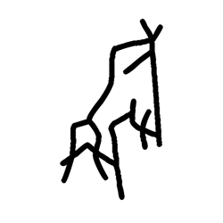

- source_zip_member: `Sub-character Images/7bgm052mqy/7bgm052mqy/ygoq48cne6.png`
- checksum_sha256: `2826a7d2b4fda84a6e76aa0290d2bdd088f3e60c5e618a9672fa7a958175fba1`
- review_status: `needs_human_visual_review`
- caution: OBIMD subcharacter image is a source-marked review asset only; it is not a confirmed component form, component assignment, or decipherment conclusion.

## asset-021076

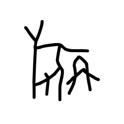

- source_zip_member: `Sub-character Images/7bgm052mqy/7bgm052mqy/z5h9jxs2na.png`
- checksum_sha256: `3f759903abbb12582403fd2753c82d5a2f4aa1e6516daacb58f1c2a88439b946`
- review_status: `needs_human_visual_review`
- caution: OBIMD subcharacter image is a source-marked review asset only; it is not a confirmed component form, component assignment, or decipherment conclusion.

## asset-021077

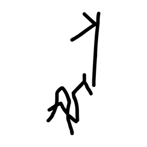

- source_zip_member: `Sub-character Images/7bgm052mqy/7bgm052mqy/zkxjifitb0.png`
- checksum_sha256: `84b5aa99e0e61d20e596ce1d46683fde69a54ad1da0fc2b68a7af61ff7abd473`
- review_status: `needs_human_visual_review`
- caution: OBIMD subcharacter image is a source-marked review asset only; it is not a confirmed component form, component assignment, or decipherment conclusion.
