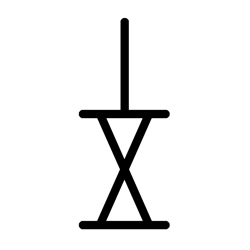

# Component Visual Gallery / 构件图像查看: obs-comp-cand-002576

English:
This page displays OBIMD subcharacter PNG assets extracted into this concrete corpus object directory for human review.

简体中文：
本页展示抽取到当前具体 corpus 对象目录内的 OBIMD subcharacter PNG 资料，供人工复核使用。

Boundary / 边界：dataset image candidate only; not a confirmed component form, component assignment, or decipherment claim.

## asset-021108

- source_zip_member: `Sub-character Images/98p045fecs/98p045fecs/98p045fecs.png`
- checksum_sha256: `e58fe66ca13526dfeca59c415488a493ad42d5705f48997b3a5baefb2b8e52e2`
- review_status: `needs_human_visual_review`
- caution: OBIMD subcharacter image is a source-marked review asset only; it is not a confirmed component form, component assignment, or decipherment conclusion.
