# Component Visual Gallery / 构件图像查看: obs-comp-cand-002649

English:
This page displays OBIMD subcharacter PNG assets extracted into this concrete corpus object directory for human review.

简体中文：
本页展示抽取到当前具体 corpus 对象目录内的 OBIMD subcharacter PNG 资料，供人工复核使用。

Boundary / 边界：dataset image candidate only; not a confirmed component form, component assignment, or decipherment claim.

## asset-021198

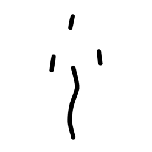

- source_zip_member: `Sub-character Images/jupncpuwyt/jupncpuwyt/07p8m5f9om.png`
- checksum_sha256: `0b713f9b6c210badbe51708fb3400eb798d118c13a40cb36e0d1f1e9a1290b64`
- review_status: `needs_human_visual_review`
- caution: OBIMD subcharacter image is a source-marked review asset only; it is not a confirmed component form, component assignment, or decipherment conclusion.

## asset-021199

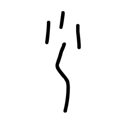

- source_zip_member: `Sub-character Images/jupncpuwyt/jupncpuwyt/4fyrs86607.png`
- checksum_sha256: `6eed27dafcdd683c8ac2e10ed2fb8bf189f3fd56c7d4b952713fac782779b58a`
- review_status: `needs_human_visual_review`
- caution: OBIMD subcharacter image is a source-marked review asset only; it is not a confirmed component form, component assignment, or decipherment conclusion.

## asset-021200

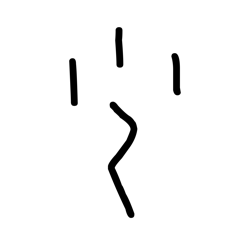

- source_zip_member: `Sub-character Images/jupncpuwyt/jupncpuwyt/52n69amn46.png`
- checksum_sha256: `3ec0e6f3d0265a955cb1df64fbcbfd299e7a2468e677ca8b16f35cee4a97b84c`
- review_status: `needs_human_visual_review`
- caution: OBIMD subcharacter image is a source-marked review asset only; it is not a confirmed component form, component assignment, or decipherment conclusion.

## asset-021201

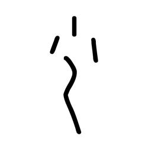

- source_zip_member: `Sub-character Images/jupncpuwyt/jupncpuwyt/5w57em6t5f.png`
- checksum_sha256: `26bfc75460fa8132825ac38e8974b555c5fd3e75e09259f3e47ef196bc6d54f5`
- review_status: `needs_human_visual_review`
- caution: OBIMD subcharacter image is a source-marked review asset only; it is not a confirmed component form, component assignment, or decipherment conclusion.

## asset-021202

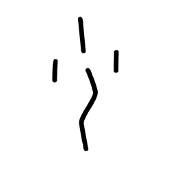

- source_zip_member: `Sub-character Images/jupncpuwyt/jupncpuwyt/5zewbj5vgy.png`
- checksum_sha256: `63c7df9c98a91a10f3efd019c87c23ba1db5d4d37e6d2a9ae13b9b59518f092b`
- review_status: `needs_human_visual_review`
- caution: OBIMD subcharacter image is a source-marked review asset only; it is not a confirmed component form, component assignment, or decipherment conclusion.

## asset-021203

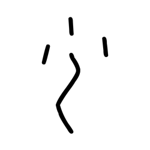

- source_zip_member: `Sub-character Images/jupncpuwyt/jupncpuwyt/9khhpgq1t5.png`
- checksum_sha256: `74afc127e6fddf65fc865f26f4dd420867c05c80808e054c273428492f69347c`
- review_status: `needs_human_visual_review`
- caution: OBIMD subcharacter image is a source-marked review asset only; it is not a confirmed component form, component assignment, or decipherment conclusion.

## asset-021204

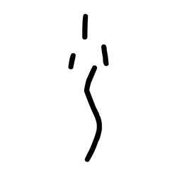

- source_zip_member: `Sub-character Images/jupncpuwyt/jupncpuwyt/d9f97sql11.png`
- checksum_sha256: `cdc2d71b8ff838f885bb816bb7b7991cb8e4e0c436ff5f333484be6c8d18b8d0`
- review_status: `needs_human_visual_review`
- caution: OBIMD subcharacter image is a source-marked review asset only; it is not a confirmed component form, component assignment, or decipherment conclusion.

## asset-021205

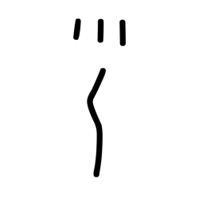

- source_zip_member: `Sub-character Images/jupncpuwyt/jupncpuwyt/hh0bv9ggkx.png`
- checksum_sha256: `1ffb172cccdcfef8df104149fef1d689bfd1159de54da5bf440630922270ab04`
- review_status: `needs_human_visual_review`
- caution: OBIMD subcharacter image is a source-marked review asset only; it is not a confirmed component form, component assignment, or decipherment conclusion.

## asset-021206

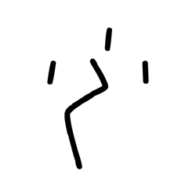

- source_zip_member: `Sub-character Images/jupncpuwyt/jupncpuwyt/ia8zbwhkim.png`
- checksum_sha256: `4c62fa207d700ff6f407293f0ba4f96f116bca9f76163f700a797a6755449b66`
- review_status: `needs_human_visual_review`
- caution: OBIMD subcharacter image is a source-marked review asset only; it is not a confirmed component form, component assignment, or decipherment conclusion.

## asset-021207

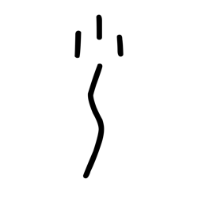

- source_zip_member: `Sub-character Images/jupncpuwyt/jupncpuwyt/j3y947qzb3.png`
- checksum_sha256: `8bb5c841fed372cf0d88afb1e1a924c3c063edaa379b5a2a28578592998dc5f1`
- review_status: `needs_human_visual_review`
- caution: OBIMD subcharacter image is a source-marked review asset only; it is not a confirmed component form, component assignment, or decipherment conclusion.

## asset-021208

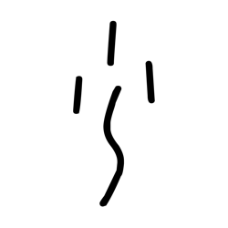

- source_zip_member: `Sub-character Images/jupncpuwyt/jupncpuwyt/je5lsl30ok.png`
- checksum_sha256: `e3263759a2edc76498ca530d0259a9470bb31f9d5843ff3fb1746f401e3f4c20`
- review_status: `needs_human_visual_review`
- caution: OBIMD subcharacter image is a source-marked review asset only; it is not a confirmed component form, component assignment, or decipherment conclusion.

## asset-021209

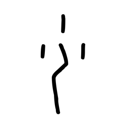

- source_zip_member: `Sub-character Images/jupncpuwyt/jupncpuwyt/jic94ebkni.png`
- checksum_sha256: `f61faeb3d610c5a7b5afe4ac48265d4cfa796f989ce0f19cabef504f18481144`
- review_status: `needs_human_visual_review`
- caution: OBIMD subcharacter image is a source-marked review asset only; it is not a confirmed component form, component assignment, or decipherment conclusion.

## asset-021210

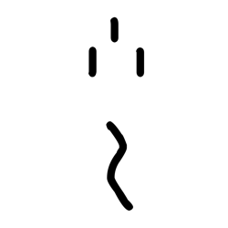

- source_zip_member: `Sub-character Images/jupncpuwyt/jupncpuwyt/jupncpuwyt.png`
- checksum_sha256: `55605860ce28fb94da6d68dbb3c72a6e51802bb94fc9f4045f3a966dcf20d985`
- review_status: `needs_human_visual_review`
- caution: OBIMD subcharacter image is a source-marked review asset only; it is not a confirmed component form, component assignment, or decipherment conclusion.

## asset-021211

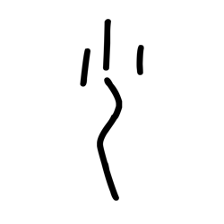

- source_zip_member: `Sub-character Images/jupncpuwyt/jupncpuwyt/lddk4gm0vy.png`
- checksum_sha256: `f2985c0a5bd375891581dd4f588b46a589360cf0378fe9d6b45f0adce66d8f73`
- review_status: `needs_human_visual_review`
- caution: OBIMD subcharacter image is a source-marked review asset only; it is not a confirmed component form, component assignment, or decipherment conclusion.

## asset-021212

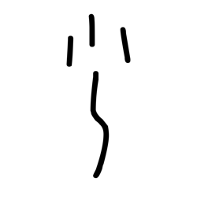

- source_zip_member: `Sub-character Images/jupncpuwyt/jupncpuwyt/lmedpf0i2i.png`
- checksum_sha256: `b36ebb754e3bfbd8b809749a4b93ed23578200de0edea4cbb3a8845fe727c69c`
- review_status: `needs_human_visual_review`
- caution: OBIMD subcharacter image is a source-marked review asset only; it is not a confirmed component form, component assignment, or decipherment conclusion.

## asset-021213

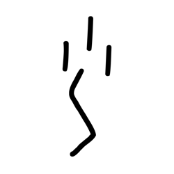

- source_zip_member: `Sub-character Images/jupncpuwyt/jupncpuwyt/mwb96p9nts.png`
- checksum_sha256: `10fd3f79b32615fb666b35fdae74b49f4b5e6d965a324fa29e0228d6a933c302`
- review_status: `needs_human_visual_review`
- caution: OBIMD subcharacter image is a source-marked review asset only; it is not a confirmed component form, component assignment, or decipherment conclusion.

## asset-021214

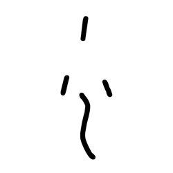

- source_zip_member: `Sub-character Images/jupncpuwyt/jupncpuwyt/n0vrxahoog.png`
- checksum_sha256: `66fde4105c5914fef114b89fdeb227293b4ba681f1815381b726a99f0f5226a5`
- review_status: `needs_human_visual_review`
- caution: OBIMD subcharacter image is a source-marked review asset only; it is not a confirmed component form, component assignment, or decipherment conclusion.

## asset-021215

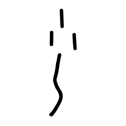

- source_zip_member: `Sub-character Images/jupncpuwyt/jupncpuwyt/n8cu4vliy4.png`
- checksum_sha256: `802367c45c163bc851656cd65ff6048395a73fa9ff8140e375c5cfa3174b63c3`
- review_status: `needs_human_visual_review`
- caution: OBIMD subcharacter image is a source-marked review asset only; it is not a confirmed component form, component assignment, or decipherment conclusion.

## asset-021216

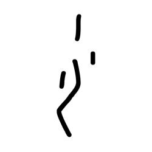

- source_zip_member: `Sub-character Images/jupncpuwyt/jupncpuwyt/nipk899wpp.png`
- checksum_sha256: `22e2d7d26308236232c60eff1d7b2fc6a27ff0efead5e1b4b790b4740a12b112`
- review_status: `needs_human_visual_review`
- caution: OBIMD subcharacter image is a source-marked review asset only; it is not a confirmed component form, component assignment, or decipherment conclusion.

## asset-021217

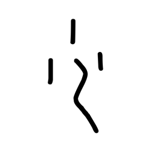

- source_zip_member: `Sub-character Images/jupncpuwyt/jupncpuwyt/p39t4frt1z.png`
- checksum_sha256: `ec410154dd37ad83e6702620589933f15b3b85337a68d142e8fb1d4af282e6f7`
- review_status: `needs_human_visual_review`
- caution: OBIMD subcharacter image is a source-marked review asset only; it is not a confirmed component form, component assignment, or decipherment conclusion.

## asset-021218

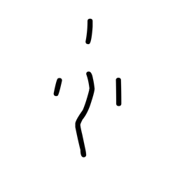

- source_zip_member: `Sub-character Images/jupncpuwyt/jupncpuwyt/p4masp67tu.png`
- checksum_sha256: `ba0b037a74a639b5d9dac258bcf09409b37db2abda526ac843a7fe93dd6bbcf1`
- review_status: `needs_human_visual_review`
- caution: OBIMD subcharacter image is a source-marked review asset only; it is not a confirmed component form, component assignment, or decipherment conclusion.

## asset-021219

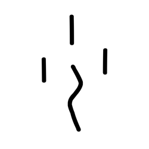

- source_zip_member: `Sub-character Images/jupncpuwyt/jupncpuwyt/wd3w3s9y0c.png`
- checksum_sha256: `ce7458fa7baa2ab8fb47eb36e7d20ae5a4488db09f7559bc9cbf80d6bc1f67c6`
- review_status: `needs_human_visual_review`
- caution: OBIMD subcharacter image is a source-marked review asset only; it is not a confirmed component form, component assignment, or decipherment conclusion.

## asset-021220

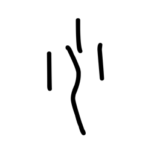

- source_zip_member: `Sub-character Images/jupncpuwyt/jupncpuwyt/wde994j70a.png`
- checksum_sha256: `10459ff643692ea670dc5328ba420a6b820fee3c2297141bbe67504e4a62ae1e`
- review_status: `needs_human_visual_review`
- caution: OBIMD subcharacter image is a source-marked review asset only; it is not a confirmed component form, component assignment, or decipherment conclusion.

## asset-021221

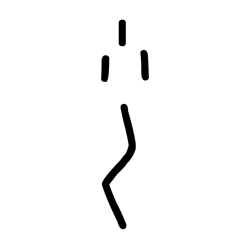

- source_zip_member: `Sub-character Images/jupncpuwyt/jupncpuwyt/x95uxr7e79.png`
- checksum_sha256: `a3f7c120de18d49129daf57af3daa2319d176040b1771d03b7386c2e399e7901`
- review_status: `needs_human_visual_review`
- caution: OBIMD subcharacter image is a source-marked review asset only; it is not a confirmed component form, component assignment, or decipherment conclusion.

## asset-021222

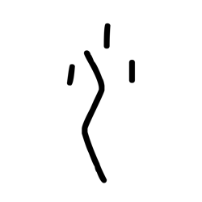

- source_zip_member: `Sub-character Images/jupncpuwyt/jupncpuwyt/z2u4ej8fj6.png`
- checksum_sha256: `7e3a39ea384a926a57a9e7e34445ea2e0474ac703b1e2e3a59118aabd14014d1`
- review_status: `needs_human_visual_review`
- caution: OBIMD subcharacter image is a source-marked review asset only; it is not a confirmed component form, component assignment, or decipherment conclusion.

## asset-021223

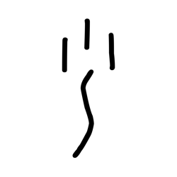

- source_zip_member: `Sub-character Images/jupncpuwyt/jupncpuwyt/zouazxe3hw.png`
- checksum_sha256: `415c3af00c302df96486ddc2adbabe8df7aaea622a6550dcc19b426efda70513`
- review_status: `needs_human_visual_review`
- caution: OBIMD subcharacter image is a source-marked review asset only; it is not a confirmed component form, component assignment, or decipherment conclusion.

## asset-021224

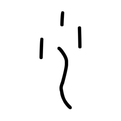

- source_zip_member: `Sub-character Images/jupncpuwyt/jupncpuwyt/zsz5fuaco9.png`
- checksum_sha256: `90983f4d181daf89e81e671b7af5fba6c8cc69778ba28303eda3e99dc9f5a2a8`
- review_status: `needs_human_visual_review`
- caution: OBIMD subcharacter image is a source-marked review asset only; it is not a confirmed component form, component assignment, or decipherment conclusion.

## asset-021225

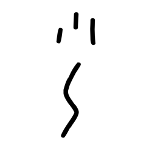

- source_zip_member: `Sub-character Images/jupncpuwyt/jupncpuwyt/zvgvuqa0mz.png`
- checksum_sha256: `1d2a90e94c7f6fb8f3980a638d57bc3ebd4fdb7c461cbfa4cf84db3bd5ad6fb2`
- review_status: `needs_human_visual_review`
- caution: OBIMD subcharacter image is a source-marked review asset only; it is not a confirmed component form, component assignment, or decipherment conclusion.
