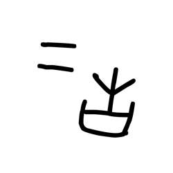
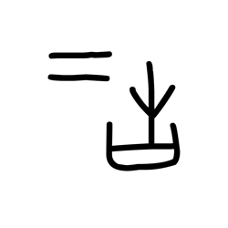
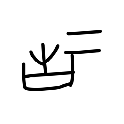
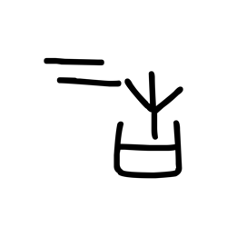
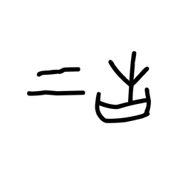
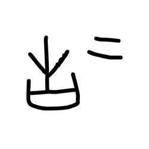
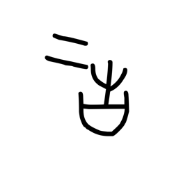
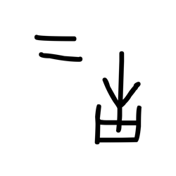
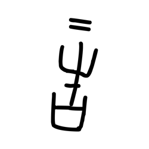

# Component Visual Gallery / 构件图像查看: obs-comp-cand-002720

English:
This page displays OBIMD subcharacter PNG assets extracted into this concrete
corpus object directory for human review.

简体中文：
本页展示抽取到当前具体 corpus 对象目录内的 OBIMD subcharacter PNG 资料，供人工复核使用。

Boundary / 边界：
dataset image candidate only; not a confirmed component form, not a component
assignment, and not a decipherment claim.
- not a confirmed component form
- not a component assignment
- not a decipherment claim

## Concrete Questions To Check / 具体待查问题

- Open 06_component-visual-index.csv and name the local image row.
- 打开 06_component-visual-index.csv，写明本地图像行。
- Open 09_component-visual-route-index.csv and name the source route row.
- 打开 09_component-visual-route-index.csv，写明来源路线行。
- Open 13_component-context-evidence-dossier.md for character context.
- 打开 13_component-context-evidence-dossier.md，核对单字与卜辞上下文。
- Record the missing image, near-shape, source, or context route.
- 记录缺失的图像、近形、来源或上下文路线。

## asset-021296

- source_zip_member: `Sub-character Images/mmknbwc3qf/mmknbwc3qf/0k6hx0fns9.png`
- checksum_sha256: see `06_component-visual-index.csv`.
- review_status: `needs_human_visual_review`
- caution: source-marked review image only.

## asset-021297

- source_zip_member: `Sub-character Images/mmknbwc3qf/mmknbwc3qf/1mxl1z8vl3.png`
- checksum_sha256: see `06_component-visual-index.csv`.
- review_status: `needs_human_visual_review`
- caution: source-marked review image only.

## asset-021298

- source_zip_member: `Sub-character Images/mmknbwc3qf/mmknbwc3qf/20ig6ppeq3.png`
- checksum_sha256: see `06_component-visual-index.csv`.
- review_status: `needs_human_visual_review`
- caution: source-marked review image only.

## asset-021299

- source_zip_member: `Sub-character Images/mmknbwc3qf/mmknbwc3qf/2n3dkmx3qe.png`
- checksum_sha256: see `06_component-visual-index.csv`.
- review_status: `needs_human_visual_review`
- caution: source-marked review image only.

## asset-021300

- source_zip_member: `Sub-character Images/mmknbwc3qf/mmknbwc3qf/7arctvl90z.png`
- checksum_sha256: see `06_component-visual-index.csv`.
- review_status: `needs_human_visual_review`
- caution: source-marked review image only.

## asset-021301

- source_zip_member: `Sub-character Images/mmknbwc3qf/mmknbwc3qf/7f6jkh6m63.png`
- checksum_sha256: see `06_component-visual-index.csv`.
- review_status: `needs_human_visual_review`
- caution: source-marked review image only.

## asset-021302

- source_zip_member: `Sub-character Images/mmknbwc3qf/mmknbwc3qf/8dc9mqn86o.png`
- checksum_sha256: see `06_component-visual-index.csv`.
- review_status: `needs_human_visual_review`
- caution: source-marked review image only.

## asset-021303

- source_zip_member: `Sub-character Images/mmknbwc3qf/mmknbwc3qf/8jedh9san5.png`
- checksum_sha256: see `06_component-visual-index.csv`.
- review_status: `needs_human_visual_review`
- caution: source-marked review image only.

## asset-021304

- source_zip_member: `Sub-character Images/mmknbwc3qf/mmknbwc3qf/8nfgpcvnzb.png`
- checksum_sha256: see `06_component-visual-index.csv`.
- review_status: `needs_human_visual_review`
- caution: source-marked review image only.

## asset-021305

- source_zip_member: `Sub-character Images/mmknbwc3qf/mmknbwc3qf/8ojplxmpwy.png`
- checksum_sha256: see `06_component-visual-index.csv`.
- review_status: `needs_human_visual_review`
- caution: source-marked review image only.

## asset-021306

- source_zip_member: `Sub-character Images/mmknbwc3qf/mmknbwc3qf/8yfj26utju.png`
- checksum_sha256: see `06_component-visual-index.csv`.
- review_status: `needs_human_visual_review`
- caution: source-marked review image only.

## asset-021307

- source_zip_member: `Sub-character Images/mmknbwc3qf/mmknbwc3qf/a0obb6yd9s.png`
- checksum_sha256: see `06_component-visual-index.csv`.
- review_status: `needs_human_visual_review`
- caution: source-marked review image only.

## asset-021308

- source_zip_member: `Sub-character Images/mmknbwc3qf/mmknbwc3qf/d27pr4eoib.png`
- checksum_sha256: see `06_component-visual-index.csv`.
- review_status: `needs_human_visual_review`
- caution: source-marked review image only.

## asset-021309

- source_zip_member: `Sub-character Images/mmknbwc3qf/mmknbwc3qf/igbjzgqj0a.png`
- checksum_sha256: see `06_component-visual-index.csv`.
- review_status: `needs_human_visual_review`
- caution: source-marked review image only.

## asset-021310

- source_zip_member: `Sub-character Images/mmknbwc3qf/mmknbwc3qf/j6s0tai7bz.png`
- checksum_sha256: see `06_component-visual-index.csv`.
- review_status: `needs_human_visual_review`
- caution: source-marked review image only.

## asset-021311

- source_zip_member: `Sub-character Images/mmknbwc3qf/mmknbwc3qf/kw469ffjve.png`
- checksum_sha256: see `06_component-visual-index.csv`.
- review_status: `needs_human_visual_review`
- caution: source-marked review image only.

## asset-021312

- source_zip_member: `Sub-character Images/mmknbwc3qf/mmknbwc3qf/mmknbwc3qf.png`
- checksum_sha256: see `06_component-visual-index.csv`.
- review_status: `needs_human_visual_review`
- caution: source-marked review image only.

## asset-021313

- source_zip_member: `Sub-character Images/mmknbwc3qf/mmknbwc3qf/qaehvdw0wn.png`
- checksum_sha256: see `06_component-visual-index.csv`.
- review_status: `needs_human_visual_review`
- caution: source-marked review image only.

## asset-021314

- source_zip_member: `Sub-character Images/mmknbwc3qf/mmknbwc3qf/toup8jj1hy.png`
- checksum_sha256: see `06_component-visual-index.csv`.
- review_status: `needs_human_visual_review`
- caution: source-marked review image only.

## asset-021315

- source_zip_member: `Sub-character Images/mmknbwc3qf/mmknbwc3qf/vibqfbmjuf.png`
- checksum_sha256: see `06_component-visual-index.csv`.
- review_status: `needs_human_visual_review`
- caution: source-marked review image only.

## asset-021316

- source_zip_member: `Sub-character Images/mmknbwc3qf/mmknbwc3qf/weoxd4hfty.png`
- checksum_sha256: see `06_component-visual-index.csv`.
- review_status: `needs_human_visual_review`
- caution: source-marked review image only.

## asset-021317

- source_zip_member: `Sub-character Images/mmknbwc3qf/mmknbwc3qf/y7yj4n6lm7.png`
- checksum_sha256: see `06_component-visual-index.csv`.
- review_status: `needs_human_visual_review`
- caution: source-marked review image only.

## asset-021318

- source_zip_member: `Sub-character Images/mmknbwc3qf/mmknbwc3qf/z7evpol9cr.png`
- checksum_sha256: see `06_component-visual-index.csv`.
- review_status: `needs_human_visual_review`
- caution: source-marked review image only.
