# Component Visual Gallery / 构件图像查看: obs-comp-cand-002722

English:
This page displays OBIMD subcharacter PNG assets extracted into this concrete
corpus object directory for human review.

简体中文：
本页展示抽取到当前具体 corpus 对象目录内的 OBIMD subcharacter PNG 资料，供人工复核使用。

Boundary / 边界：
dataset image candidate only; not a confirmed component form, not a component
assignment, and not a decipherment claim.
- not a confirmed component form
- not a component assignment
- not a decipherment claim

## Concrete Questions To Check / 具体待查问题

- Open 06_component-visual-index.csv and name the local image row.
- 打开 06_component-visual-index.csv，写明本地图像行。
- Open 09_component-visual-route-index.csv and name the source route row.
- 打开 09_component-visual-route-index.csv，写明来源路线行。
- Open 13_component-context-evidence-dossier.md for character context.
- 打开 13_component-context-evidence-dossier.md，核对单字与卜辞上下文。
- Record the missing image, near-shape, source, or context route.
- 记录缺失的图像、近形、来源或上下文路线。

## asset-021320

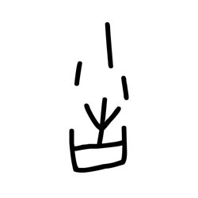

- source_zip_member: `Sub-character Images/ak5swmi6nj/ak5swmi6nj/2ga4s306eq.png`
- checksum_sha256: see `06_component-visual-index.csv`.
- review_status: `needs_human_visual_review`
- caution: source-marked review image only.

## asset-021321

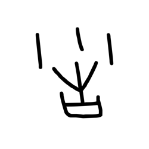

- source_zip_member: `Sub-character Images/ak5swmi6nj/ak5swmi6nj/3opt7k5gio.png`
- checksum_sha256: see `06_component-visual-index.csv`.
- review_status: `needs_human_visual_review`
- caution: source-marked review image only.

## asset-021322

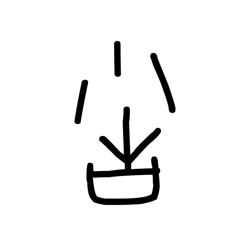

- source_zip_member: `Sub-character Images/ak5swmi6nj/ak5swmi6nj/4xh3a60pi3.png`
- checksum_sha256: see `06_component-visual-index.csv`.
- review_status: `needs_human_visual_review`
- caution: source-marked review image only.

## asset-021323

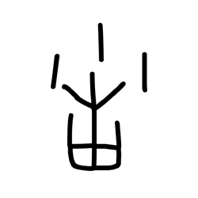

- source_zip_member: `Sub-character Images/ak5swmi6nj/ak5swmi6nj/535ur0heww.png`
- checksum_sha256: see `06_component-visual-index.csv`.
- review_status: `needs_human_visual_review`
- caution: source-marked review image only.

## asset-021324

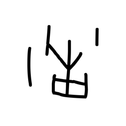

- source_zip_member: `Sub-character Images/ak5swmi6nj/ak5swmi6nj/5doesqso46.png`
- checksum_sha256: see `06_component-visual-index.csv`.
- review_status: `needs_human_visual_review`
- caution: source-marked review image only.

## asset-021325

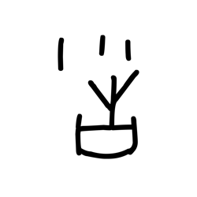

- source_zip_member: `Sub-character Images/ak5swmi6nj/ak5swmi6nj/6kykipvzml.png`
- checksum_sha256: see `06_component-visual-index.csv`.
- review_status: `needs_human_visual_review`
- caution: source-marked review image only.

## asset-021326

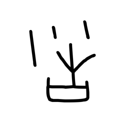

- source_zip_member: `Sub-character Images/ak5swmi6nj/ak5swmi6nj/8e67hmc76u.png`
- checksum_sha256: see `06_component-visual-index.csv`.
- review_status: `needs_human_visual_review`
- caution: source-marked review image only.

## asset-021327

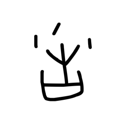

- source_zip_member: `Sub-character Images/ak5swmi6nj/ak5swmi6nj/9y649lwabu.png`
- checksum_sha256: see `06_component-visual-index.csv`.
- review_status: `needs_human_visual_review`
- caution: source-marked review image only.

## asset-021328

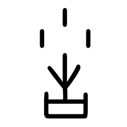

- source_zip_member: `Sub-character Images/ak5swmi6nj/ak5swmi6nj/ak5swmi6nj.png`
- checksum_sha256: see `06_component-visual-index.csv`.
- review_status: `needs_human_visual_review`
- caution: source-marked review image only.

## asset-021329

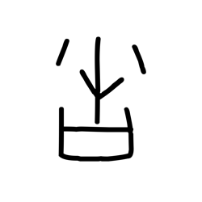

- source_zip_member: `Sub-character Images/ak5swmi6nj/ak5swmi6nj/blk7beuyup.png`
- checksum_sha256: see `06_component-visual-index.csv`.
- review_status: `needs_human_visual_review`
- caution: source-marked review image only.

## asset-021330

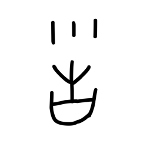

- source_zip_member: `Sub-character Images/ak5swmi6nj/ak5swmi6nj/bq1hotokab.png`
- checksum_sha256: see `06_component-visual-index.csv`.
- review_status: `needs_human_visual_review`
- caution: source-marked review image only.

## asset-021331

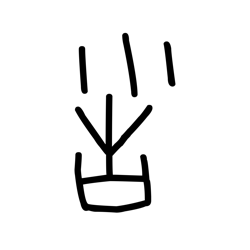

- source_zip_member: `Sub-character Images/ak5swmi6nj/ak5swmi6nj/gsgevvgn87.png`
- checksum_sha256: see `06_component-visual-index.csv`.
- review_status: `needs_human_visual_review`
- caution: source-marked review image only.

## asset-021332

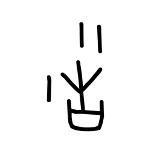

- source_zip_member: `Sub-character Images/ak5swmi6nj/ak5swmi6nj/h175g00vu5.png`
- checksum_sha256: see `06_component-visual-index.csv`.
- review_status: `needs_human_visual_review`
- caution: source-marked review image only.

## asset-021333

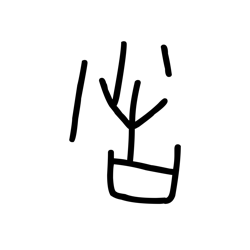

- source_zip_member: `Sub-character Images/ak5swmi6nj/ak5swmi6nj/mzpwh620h5.png`
- checksum_sha256: see `06_component-visual-index.csv`.
- review_status: `needs_human_visual_review`
- caution: source-marked review image only.

## asset-021334

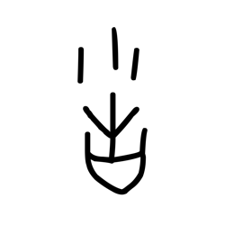

- source_zip_member: `Sub-character Images/ak5swmi6nj/ak5swmi6nj/oql2ym949e.png`
- checksum_sha256: see `06_component-visual-index.csv`.
- review_status: `needs_human_visual_review`
- caution: source-marked review image only.

## asset-021335

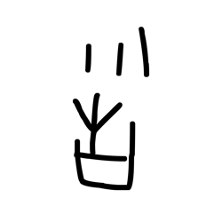

- source_zip_member: `Sub-character Images/ak5swmi6nj/ak5swmi6nj/pidp9usy1c.png`
- checksum_sha256: see `06_component-visual-index.csv`.
- review_status: `needs_human_visual_review`
- caution: source-marked review image only.

## asset-021336

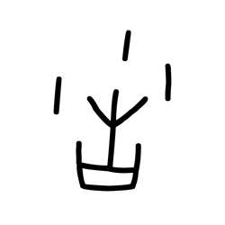

- source_zip_member: `Sub-character Images/ak5swmi6nj/ak5swmi6nj/rjjzb5zcld.png`
- checksum_sha256: see `06_component-visual-index.csv`.
- review_status: `needs_human_visual_review`
- caution: source-marked review image only.

## asset-021337

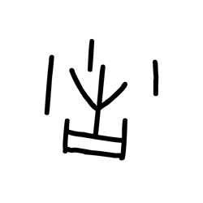

- source_zip_member: `Sub-character Images/ak5swmi6nj/ak5swmi6nj/tqccdj95xr.png`
- checksum_sha256: see `06_component-visual-index.csv`.
- review_status: `needs_human_visual_review`
- caution: source-marked review image only.

## asset-021338

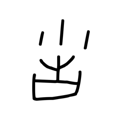

- source_zip_member: `Sub-character Images/ak5swmi6nj/ak5swmi6nj/uq9gigi04s.png`
- checksum_sha256: see `06_component-visual-index.csv`.
- review_status: `needs_human_visual_review`
- caution: source-marked review image only.
