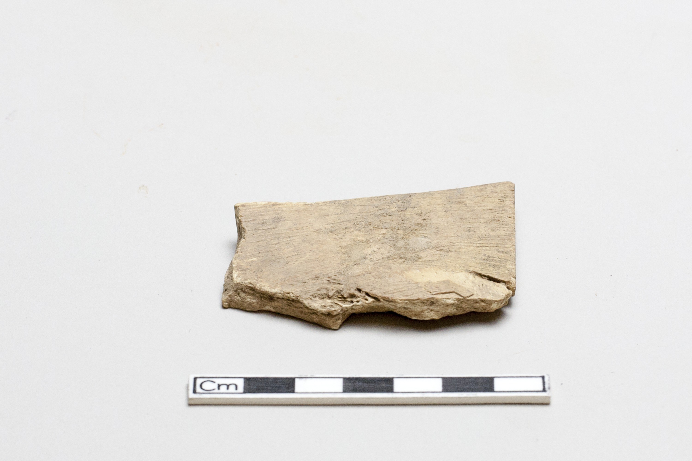

# coll-obj-cand-00053 collection object candidate

English:
This directory is the object-local research entrance for one museum or
collection object candidate. Human-readable notes, visual routes, review
prompts, and provenance dossiers are the primary materials. Structured support
files only serve the human collection dossier, source tracing, comparison, and
review.

简体中文：
本目录是一个馆藏或出土相关对象候选的对象内研究入口。
人类可读说明、图像入口、复核提示和出处档案是主体资料。
结构化辅助文件只服务人类馆藏档案、来源追溯、比较和复核。

## Boundary / 边界

- This is not a confirmed inscription identity.
- This is not a transcription, formal reading, component analysis, or
  decipherment conclusion.
- Object labels and image links are source metadata for review only.
- 本对象不是已确认的卜辞身份，不是释文、正式释读、构件分析或
  破译结论；馆藏标签和图像链接只作为待复核来源 metadata。

## Visual Entrance / 图像入口

Committed image asset: `asset_id=asset-000003`.

## Local Files / 本目录文件

- `04_visual-gallery.md`: human-facing image or thumbnail route sheet.
- `05_human-review-sheet.md`: human review checklist.
- `06_human-collection-dossier.md`: human collection object dossier.
- `08_collection-provenance-evidence-dossier.md`: human source evidence dossier.
- `10_collection-provenance-fact-matrix.md`: human provenance fact matrix.
- `12_archaeological-context-review.md`: human archaeological context review
  sheet.
- `14_human-research-readiness-review.md`: human pre-research readiness and
  missing-evidence review.
- `16_preformal-research-start-check.md`: human opening check before formal
  research starts.

- `18_material-image-inspection-note.md`: bounded observations from the local
  source-linked image.

## Structured Support Files / 结构化辅助文件

- `01_collection-object-packet.json`: structured candidate support packet.
- `02_collection-source-index.csv`: source, download, rights, and route support
  table.
- `03_visual-asset-index.csv`: committed asset, thumbnail URL, or missing-image
  status.
- `07_collection-dossier-index.json`: structured dossier support index.
- `09_collection-provenance-evidence-index.json`: structured evidence index.
- `11_collection-provenance-fact-matrix-index.json`: structured fact index.
- `13_archaeological-context-index.json`: structured support index for
  archaeological context review.
- `15_human-research-readiness-index.json`: structured support index for the
  human readiness review.
- `17_preformal-research-start-index.json`: structured support index for the
  preformal start check.

## Object Metadata / 对象 metadata

- provider: `Smithsonian National Museum of Asian Art`
- collection_name: `Freer Gallery of Art Study Collection`
- source_collection_item_id: `FSC-O-26`
- object_title_en: `Oracle bone, incribed`
- accession_number: `FSC-O-26`
- historical_period: `Shang dynasty, ca. 1600 - ca. 1050 BCE`
- geography: `China`
- medium: `Bone`
- dimensions: `H x W x D: 6.7 x 4.4 x 1 cm`
- credit_line: `Gift of the John Hadley Cox Archaeological Study Collection`
- provenance_note: `John Hadley Cox purchased in Xiaotun, Anyang, Honan
  province, China; Freer Gallery of Art received the object as a gift in 1991.`
- object_page_url: `https://asia-archive.si.edu/object/FSC-O-26`

## Review Status / 复核状态

Current status: `needs_human_collection_object_review`. Reviewers must verify
source pages, rights status, object labels, image provenance, and inscription
context before promotion.
