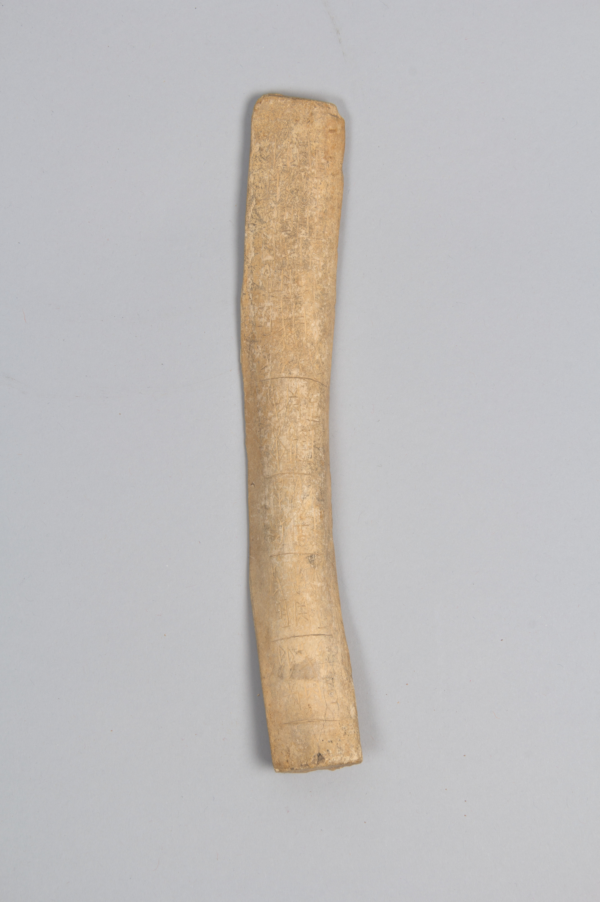

# Visual Gallery / 图像入口

Project ID: `coll-obj-cand-00055`

## Committed Asset / 已提交图像

- Asset ID: `asset-000001`
- Asset path: `corpus/005_excavation-sites-periods-and-batches/001_public-domain-object-image-assets/001_asset-000001_met-obj-42045_object-image.jpg`
- Source image URL: https://images.metmuseum.org/CRDImages/as/original/LC-67_43_14_002.jpg
- Rights status: `public_domain_verified`

## Boundary / 边界

This page is a human visual entrance only. It is not glyph segmentation, not component analysis, not a transcription, and not a decipherment conclusion.
